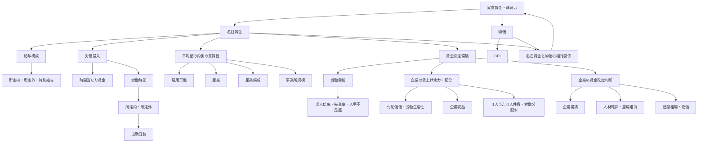

# 実質賃金関連分析：全体像と結論

更新日：2026-09-05  
主分析期間：2015年平均から2025年平均  
企業業績分析：2015年度から2024年度を中心に、長期時系列では2000年度から2024年度  
主な使用統計：

- 厚生労働省「毎月勤労統計調査」
- 総務省「消費者物価指数」
- 厚生労働省「一般職業紹介状況」
- 総務省「労働力調査」
- 日本銀行「全国企業短期経済観測調査」
- 財務省「法人企業統計調査」
- 厚生労働省「賃金引上げ等の実態に関する調査」

---

## 1. この文書の目的

本プロジェクトでは、名目賃金と物価の推移を表示するだけでなく、次の問いを段階的に検証してきた。

> 「毎月勤労統計の5人以上事業所における平均賃金」に関係する変化を、給与構成、労働投入、雇用形態、産業構成、事業所規模、労働需給、企業の付加価値・生産性・収益・分配、企業の賃金改定行動、物価の各側面からどこまで説明できるか。

この文書は、個別分析で得られた結果を一つの説明体系に統合し、現時点での結論、分析から言えること、まだ言えないことを明確にするための概要文書である。

数式、データ検証、実装方法、詳細な結果は各個別分析文書に記載する。

---

## 2. 現時点での全体結論

### 2.1 名目賃金は上昇したが、その内訳は一様ではない

2015年から2025年にかけて、日本の名目賃金は広い産業で上昇した。

現金給与総額の上昇は主として**所定内給与の増加**によって構成され、所定外給与の長期的な寄与は小さかった。特別給与も一定の寄与を持ったが、長期的な賃金上昇の中心は所定内給与だった。

月額のきまって支給する給与を労働投入の面から分解すると、**概算時間当たり賃金の上昇**が月額賃金を押し上げる一方、**総実労働時間の減少**がその一部を相殺していた。

したがって、2015年以降の名目賃金上昇は、残業増加だけで生じたものではなく、基礎的な賃金部分と時間当たり賃金の上昇を中心とする変化だった。

### 2.2 労働時間減少の中心は所定内労働時間と出勤日数だった

労働時間の減少は残業時間の減少だけではない。

総実労働時間の減少の中心は**所定内労働時間**であり、その所定内労働時間の減少をさらに分解すると、1出勤日当たりの勤務時間短縮よりも**月間出勤日数の減少**の寄与が大きかった。

この傾向は一般労働者とパートタイム労働者の双方で確認された。

### 2.3 全国平均の方向は主要産業に広く共通した

主要16産業すべてで、

- 月額賃金の上昇
- 概算時間当たり賃金の上昇
- 総実労働時間の減少

が確認された。

したがって、全国平均でみられる「時間当たり賃金上昇と労働時間減少」という組み合わせは、一部の産業だけによるものではない。

一方、月額賃金上昇率や時間当たり賃金、労働時間の変化幅には大きな産業差があり、全国平均だけでは産業ごとの調整構造を十分に捉えられない。

### 2.4 産業構成変化は平均賃金上昇の主因ではなかった

産業別賃金と雇用シェアを用いた分解では、2015年から2025年の平均賃金上昇の中心は**各産業内の賃金上昇**だった。

産業間の雇用構成変化は、平均賃金をわずかに押し下げる方向に作用していた。

したがって、近年の平均賃金上昇を「高賃金産業への雇用移動」によって説明することはできない。

### 2.5 労働需給の逼迫と賃金上昇には関連があるが、固定的な反応関係ではない

求人倍率、完全失業率を逼迫方向に変換した指標、短観の人手不足感と所定内給与上昇率の間には、概ね正の相関が確認された。

一方、相関の強さや最大相関となるラグは時期や指標によって異なり、「労働需給が逼迫すると一定期間後に必ず賃金が上がる」という固定的な関係は確認できなかった。

労働需給は賃金上昇圧力の一つとして重要だが、それだけで近年の賃金上昇を説明することはできない。

### 2.6 企業の生産性・収益力は改善したが、人件費は同率では増えなかった

法人企業統計では、2015年度から2024年度にかけて、全産業・全規模の労働生産性は**12.69%上昇**し、1人当たり人件費は**7.29%上昇**、労働分配率は**3.27ポイント低下**した。

営業利益率・経常利益率も上昇しており、企業側の付加価値創出力・収益力の改善が、人件費へ同じ割合で反映されたわけではなかった。

企業規模別では、大企業ほど生産性・収益性の改善が大きかった。一方、中小企業では、労働分配率が高いにもかかわらず、生産性と1人当たり人件費の水準が低かった。

したがって、労働分配率の高さだけで「賃金を上げる余力が大きい」と判断することはできない。

### 2.7 生産性と賃金の関係は時期によって変化した

企業側指標と賃金の長期時系列では、労働生産性前年比と月額賃金前年比に一定の正の関連がみられた。

ただし、その関係は期間によって大きく異なった。近年では強い正の相関がみられる一方、それ以前の期間では弱い、あるいは負の関係となる場合もあった。

したがって、「生産性が上がれば一定割合で賃金も上がる」という普遍的な関係は確認できない。

### 2.8 近年は企業の賃金改定行動そのものが変化している

「賃金引上げ等の実態に関する調査」では、企業規模計の1人平均賃金改定率は2021年の**1.6%**から、2023年3.2%、2024年4.1%、2025年**4.4%**へ上昇した。

賃金を引き上げた企業割合も2021年の80.7%から2025年の91.5%へ上昇しており、近年は、

- 賃上げを行う企業の広がり
- 賃上げ幅そのものの拡大

が同時に進んでいる。

賃金改定時に最も重視した要素では、2015年から2025年にかけて「企業の業績」の割合が低下する一方、

- 労働力の確保・定着
- 雇用の維持
- 世間相場

の重要性が上昇した。

したがって、企業業績は依然として主要な判断材料であるものの、近年は人手不足や外部賃金相場をより強く意識した賃金改定へ移行している。

### 2.9 2015～2025年の実質賃金低下は、名目賃金の伸びを物価上昇が上回ったためである

実質賃金の名目賃金・物価要因分解では、2015年から2025年までの公表前年比を連鎖すると、

- 名目賃金：**+9.73%**
- CPI（持家の帰属家賃を除く総合）：**+16.59%**
- 機械的な実質賃金：**-5.88%**

となった。

対数分解では、

- 名目賃金寄与：**+9.29**
- 物価寄与：**-15.35**
- 実質賃金変化：**-6.06**

となった。

したがって、2015～2025年の実質賃金低下は、

> 名目賃金が全く伸びなかったためではなく、名目賃金以上に物価が上昇したため

と整理できる。

特に2022年以降は、名目賃金が増加していてもCPI上昇率がそれを上回る年が続き、実質購買力の改善につながりにくかった。

### 2.10 実質賃金の評価は月額か時間当たりかで異なる

雇用形態別比較では、2015年から2025年の実質月額賃金は、

- 一般労働者：**-2.9%**
- パートタイム労働者：**+1.4%**

だった。

一方、実質概算時間当たり賃金は、

- 一般労働者：**+2.0%**
- パートタイム労働者：**+14.2%**

となった。

月額の購買力と時間当たりの購買力で結果が異なる背景には、労働時間の減少がある。

したがって、「実質賃金が上がったか下がったか」を単一の数字だけで評価するのは適切ではない。

### 2.11 事業所規模別では月額賃金差はほぼ維持されたが、内部構造は変化した

2015年から2025年にかけて、就業形態計の月額賃金は、

- 5人以上系列：**+12.69%**
- 30人以上系列：**+12.82%**

となり、伸び率はほぼ同じだった。

30人以上 / 5人以上の月額賃金比率も、

- 2015年：1.145
- 2025年：1.146

で、相対的な規模差はほぼ横ばいだった。

ただし、その内訳では、

- 時間当たり賃金比率の寄与：**-1.37**
- 労働時間比率の寄与：**+1.48**
- 月額賃金比率変化：**+0.11**

となった。

つまり、

> 時間当たり賃金の規模差は縮小した一方、30人以上系列の労働時間が相対的に長くなる方向へ差が動き、その結果として月額賃金差がほぼ維持された

と整理できる。

就業形態別では、一般労働者では月額賃金差が縮小し、パートタイム労働者では拡大しており、事業所規模差の動きは就業形態によって異なる。

---

## 3. 分析体系



分析全体の説明経路は、次のように整理できる。

```text
労働需給・人手不足
        │
        ├─→ 賃上げ圧力
        │
企業収益・生産性・付加価値
        │
        └─→ 賃上げ余力
                ↓
        企業の賃金改定判断
                ↓
             名目賃金
                ↓
        物価上昇との相対関係
                ↓
          実質賃金・購買力
```

雇用形態、産業、産業構成、事業所規模の分析は、この経路の平均値の内側にある異質性を確認する位置づけである。

---

## 4. 分析結果の種類

分析結果は、次の種類を区別して解釈する。

| 分析の種類         | 内容                                                                 | 解釈できること                                     |
| ------------------ | -------------------------------------------------------------------- | -------------------------------------------------- |
| 恒等的・機械的分解 | 給与構成、賃金単価と労働時間、産業構成、名目賃金と物価、規模差の内訳 | どの構成要素の変化が全体の変化を構成したか         |
| 記述的比較         | 雇用形態別、産業別、事業所規模別、時期別比較                         | 対象間でどのような違いが観察されたか               |
| 統計的関連         | 労働需給指標、企業業績指標と賃金変化率の相関・ラグ相関               | 指標間にどの程度の関連があるか                     |
| 意識・行動の記述   | 賃金改定率、賃上げ企業割合、企業の重視要因                           | 企業がどのような賃金改定行動をとり、何を重視したか |

恒等的分解であっても、構成要素が変化した原因までは示さない。

相関分析は因果関係を示さない。

企業アンケートの回答は企業の自己認識を表すが、その回答要因が賃上げを因果的に引き起こしたことまでは示さない。

---

## 5. 共通する主分析条件

個別分析の比較可能性を高めるため、名目賃金側の主要な長期分析では原則として次の条件を使用した。

| 項目       | 条件                                               |
| ---------- | -------------------------------------------------- |
| 比較期間   | 2015年平均から2025年平均                           |
| 産業       | 調査産業計、または比較可能な主要16産業             |
| 事業所規模 | 原則5人以上                                        |
| 就業形態   | 原則就業形態計                                     |
| 賃金       | 現金給与総額、きまって支給する給与、各給与構成項目 |
| 労働時間   | 総実労働時間、所定内労働時間、所定外労働時間       |
| 集計       | 各年の12か月が揃った年平均                         |

2015年と2025年を使用した理由は、単月の季節性や一時的変動を避けつつ、コロナ前、コロナ期、回復期、近年の賃上げ・物価上昇局面を含む長期変化を確認するためである。

主な例外は次のとおり。

- 雇用形態比較では、一般労働者とパートタイム労働者を分ける。
- 実質値では分析目的に応じてCPI系列を明示する。
- 労働需給分析では2000年以降の月次・四半期データを用いる。
- 企業収益・生産性分析では法人企業統計の年度データを用いる。
- 企業側指標と毎月勤労統計を比較する場合は、毎月勤労統計を年度平均へ再集計する。
- 事業所規模別分析では、5人以上系列と30人以上系列を比較する。
- 実質賃金要因分解では、公表前年比と公式系列との整合性を確認しながら長期変化を評価する。

---

## 6. 主要結果

| 分析                         | 主な結果                                                                         | 分析上の意味                                                         |
| ---------------------------- | -------------------------------------------------------------------------------- | -------------------------------------------------------------------- |
| 給与構成                     | 現金給与総額+12.72%。所定内給与+8.46pt、特別給与+4.22pt、所定外給与+0.04pt       | 総額上昇の最大の構成要素は所定内給与                                 |
| 労働投入                     | 月額のきまって支給する給与+10.30%、概算時間当たり賃金+17.95%、総実労働時間-6.49% | 賃金単価上昇を労働時間減少が一部相殺                                 |
| 労働時間内訳                 | 総実労働時間の減少の中心は所定内労働時間                                         | 残業削減だけでは説明できない                                         |
| 出勤日数                     | 所定内労働時間減少の中心は出勤日数                                               | 1日当たり勤務時間短縮より出勤日数変化が大きい                        |
| 産業別                       | 主要16産業すべてで月額賃金・概算時間当たり賃金上昇、総実労働時間減少             | 全国平均の方向は主要産業に広く共通                                   |
| 産業構成                     | 平均賃金+10.30%、産業内賃金効果+10.66pt、産業構成効果-0.21pt、交差効果-0.15pt    | 平均賃金上昇の中心は産業内賃金上昇                                   |
| 労働需給                     | 複数の需給指標と所定内給与前年比に正の関連                                       | 人手不足は賃上げ圧力の一要素                                         |
| 企業収益・生産性             | 2015→2024年度で生産性+12.69%、1人当たり人件費+7.29%、労働分配率-3.27pt           | 企業側の改善が同率で人件費へ反映されたわけではない                   |
| 賃金改定行動                 | 改定率2021年1.6%→2025年4.4%、賃上げ企業割合80.7%→91.5%                           | 賃上げの広がりと改定幅拡大が同時進行                                 |
| 実質賃金要因分解             | 名目賃金+9.73%、CPI+16.59%、機械的実質賃金-5.88%                                 | 実質賃金低下の主因は物価上昇が名目賃金上昇を上回ったこと             |
| 雇用形態別実質月額賃金       | 一般-2.9%、パート+1.4%                                                           | 実質的効果は就業形態で異なる                                         |
| 雇用形態別実質時間当たり賃金 | 一般+2.0%、パート+14.2%                                                          | 月額と時間当たりで実質評価が異なる                                   |
| 事業所規模別                 | 5人以上+12.69%、30人以上+12.82%。月額賃金比率はほぼ横ばい                        | 規模差の総量は維持されたが、時間当たり賃金差と労働時間差の内訳は変化 |

---

## 7. 結果の統合

### 7.1 名目賃金上昇は「賃金単価上昇」と「労働時間減少」の同時進行だった

2015年以降の月額賃金の変化は、単純な賃上げだけではない。

概算時間当たり賃金は月額賃金以上に上昇しており、その一方で総実労働時間が減少した。

したがって、月額賃金だけを見ると、時間当たり賃金の改善を過小評価する場合がある。

一方、生活者の購買力という観点では、最終的に受け取る月額賃金も重要であり、両方を区別して評価する必要がある。

### 7.2 労働時間減少は賃金上昇の効果を月額ベースで一部相殺した

概算時間当たり賃金の上昇が月額賃金を押し上げた一方、総実労働時間の減少がその一部を相殺した。

この労働時間減少は、主として所定内労働時間と出勤日数の減少から生じていた。

したがって、実質月額賃金の弱さを理解するには、物価だけでなく、労働投入量の変化も考慮する必要がある。

### 7.3 全国平均の変化は産業構成だけでは説明できない

主要16産業すべてで時間当たり賃金上昇が確認され、産業構成分解でも平均賃金上昇の中心は産業内賃金上昇だった。

したがって、全国平均の上昇を単なる「高賃金産業の比率上昇」とみなすことはできない。

### 7.4 労働需給、企業余力、企業判断を分けて考える必要がある

これまでの結果は、賃金決定を少なくとも次の3段階に分ける必要があることを示している。

```text
労働需給 → 賃上げ圧力
企業収益・生産性 → 賃上げ余力
企業の意思決定 → 実際の賃金改定
```

労働需給が逼迫しても、企業に支払い余力がなければ高い賃上げは困難である。

企業収益が改善しても、それが自動的に賃金へ配分されるわけではない。

近年は企業の賃金改定行動自体が変化しており、人材確保や世間相場の重要性が高まっている。

### 7.5 近年の賃上げは企業行動の変化まで含む局面と考えられる

2023年以降、賃上げ実施企業割合と平均賃金改定率がともに上昇した。

同時に、企業が重視する要因も、従来の企業業績中心から、人材確保、雇用維持、世間相場などをより重視する方向へ変化している。

したがって、近年の賃上げ局面は単に景気や収益が改善した結果ではなく、労働市場環境を受けた企業行動の変化を伴う可能性がある。

### 7.6 それでも実質購買力は改善しなかった

名目賃金が上昇していても、物価上昇率がそれを上回れば実質賃金は低下する。

2015～2025年では、名目賃金は約9.7%上昇したが、対象CPIは約16.6%上昇した。

したがって、名目賃金上昇は確認できるものの、生活者の購買力という最終アウトカムでは十分ではなかった。

この点が、本分析体系の最終的な接続点である。

### 7.7 平均値の内側では就業形態・産業・事業所規模による違いが残る

全国平均の方向は共通していても、その変化幅は均一ではない。

雇用形態別では、実質月額賃金と実質時間当たり賃金の改善度が異なる。

産業別では賃金上昇幅に大きな差がある。

事業所規模別では月額賃金差はほぼ維持されたが、その内部では時間当たり賃金差が縮小し、労働時間差が逆方向に動いた。

したがって、「平均賃金」という一つの指標だけでは、労働市場内部の異質性を十分に表せない。

---

## 8. この分析体系から言えること

- 2015年から2025年の名目賃金上昇は、主として所定内給与の増加によって構成されていた。
- 月額賃金より概算時間当たり賃金の伸びが大きく、労働時間減少が月額賃金の伸びを一部相殺していた。
- 長期的な労働時間減少の中心は所定内労働時間であり、さらに出勤日数減少の寄与が大きかった。
- 「時間当たり賃金上昇と労働時間減少」という組み合わせは主要産業に広く見られた。
- 平均賃金上昇の中心は産業構成変化ではなく、各産業内の賃金上昇だった。
- 労働需給の逼迫と所定内給与上昇には正の関連がある。
- 2015年度から2024年度にかけて企業の生産性・収益性は改善したが、1人当たり人件費は同率では増加せず、労働分配率は低下した。
- 生産性と賃金の関連は時期によって変化し、固定的な関係ではない。
- 近年は賃上げを行う企業割合と賃金改定率がともに上昇した。
- 企業の賃金改定判断では、人材確保・雇用維持・世間相場の重要性が高まった。
- 2015～2025年の実質賃金低下は、名目賃金が伸びなかったからではなく、物価上昇が名目賃金上昇を上回ったためである。
- 実質賃金の評価は月額と時間当たりで異なり、就業形態によっても結果が異なる。
- 5人以上系列と30人以上系列の月額賃金上昇率はほぼ同じで、相対的な月額賃金差はほぼ維持された。
- ただし、事業所規模別の月額賃金差の内部では、時間当たり賃金差と労働時間差が異なる方向に変化していた。

---

## 9. この分析体系だけでは言えないこと

- 所定内給与が上昇した因果的な理由
- 出勤日数が減少した因果的な理由
- 個々の労働者が同じ仕事でどの程度賃上げされたか
- 平均値と中央値、賃金分布の各層がどのように変化したか
- 産業内賃金効果のうち、純粋な賃金率上昇と属性構成変化がそれぞれどの程度か
- 求人倍率の上昇が賃上げを直接引き起こしたか
- 最大相関ラグが企業の実際の賃金決定期間を表すか
- 春闘や最低賃金が近年の賃金上昇に与えた因果的な影響
- 生産性や企業収益の上昇が賃金上昇を因果的に引き起こしたか
- 労働分配率の低下が企業の意図的な賃金抑制によるものか
- 個別企業で生産性・収益性の改善が賃金へどの程度還元されたか
- 企業が回答した賃金改定理由が、実際の賃金改定をどの程度因果的に決定したか
- 5人以上系列と30人以上系列の差を、企業規模そのものの因果効果として解釈できるか
- 特定の世帯または個人が経験した生活費上昇と実質購買力の変化
- CPI総合では捉えられない世帯属性別・費目別の生活費負担差

---

## 10. 分析上の主な注意点

### 10.1 平均値の分析

毎月勤労統計の集計平均を用いており、同一人物の賃金変化や賃金分布を表すものではない。

平均値は、雇用形態、産業、年齢、性別、職種、事業所規模などの構成変化によっても動く。

### 10.2 概算時間当たり賃金

「きまって支給する給与 ÷ 総実労働時間」で算出した分析用指標であり、公的統計として公表される正式な時間当たり賃金ではない。

### 10.3 実質値

実質値は、分析目的に応じて名目賃金をCPIで実質化した値、または公表されている実質賃金系列を利用する。

CPI系列の選択によって結果は変わりうるため、使用系列を明示する必要がある。

### 10.4 分解と因果

給与構成、労働投入、産業構成、実質賃金要因、事業所規模差の分解は、全体の変化をどの構成要素が作ったかを示す。

各構成要素が変化した原因を示すものではない。

### 10.5 相関と因果

労働需給分析や企業指標との時系列分析は相関分析であり、因果効果を推定したものではない。

ラグ相関の最大値も、企業の実際の意思決定期間を直接表すものではない。

### 10.6 法人企業統計と毎月勤労統計は同一概念ではない

法人企業統計の人件費は、企業側の労働コストを表し、毎月勤労統計の労働者側の賃金とは一致しない。

対象産業、規模区分、集計単位も異なるため、両統計の比較は概念上の近似である。

### 10.7 企業規模と事業所規模は異なる

法人企業統計では資本金階層、短観では独自の企業規模区分、毎月勤労統計では事業所規模を使用している。

これらは同じ規模概念ではない。

また、毎月勤労統計の5人以上系列と30人以上系列は包含関係を持つため、独立した二群の比較ではない。

### 10.8 短期間の強い相関は一般化しない

企業業績と賃金の期間別分析では、2020～2024年度など観測数の少ない区間を含む。

強い相関係数が得られても、安定した一般則として解釈しない。

---

## 11. 残された重要な分析課題

主要な説明経路については、

```text
名目賃金の内部構造
↓
労働需給・企業側の賃上げ余力
↓
企業の賃金改定行動
↓
名目賃金
↓
物価
↓
実質賃金
```

まで一通り接続できた。

今後は、新しい説明変数を増やすことよりも、既存分析の頑健性確認と、平均値では捉えられない分布・属性差の分析を優先する。

優先度の高い課題は次のとおり。

1. **春闘賃上げ率と所定内給与の接続**
   - 春闘の妥結結果が毎月勤労統計の所定内給与へどの程度反映されるかを確認する。

2. **最低賃金とパートタイム労働者賃金の接続**
   - 最低賃金引上げとパートタイム労働者の時間当たり賃金の関係を確認する。

3. **賃金分布・属性別分析**
   - 賃金構造基本統計調査を用いて、中央値、分位、年齢、勤続年数、性別、職種等を分析する。

4. **物価上昇の費目別分解**
   - 食料、住居、光熱、水道など、どの費目が実質購買力を圧迫したかを整理する。

5. **既存分析の時系列更新**
   - 2026年以降の公表値を追加し、近年の賃上げが実質賃金改善へ転じるかを継続確認する。

6. **統計間の概念差・頑健性の再検証**
   - CPI系列、賃金系列、企業側指標、規模区分の変更によって結論がどの程度変わるかを確認する。

---

## 12. 個別分析文書

| 番号 | 文書                                                     | 内容                                   |
| ---- | -------------------------------------------------------- | -------------------------------------- |
| 01   | [employment_comparison](01_employment_comparison.md)     | 雇用形態別の賃金・労働時間・実質値比較 |
| 02   | [wage_composition](02_wage_composition.md)               | 給与構成の要因分解                     |
| 03   | [labor_input](03_labor_input.md)                         | 賃金単価・労働時間・出勤日数の分解     |
| 04   | [industry_wage](04_industry_wage.md)                     | 産業別賃金・労働時間分析               |
| 05   | [industry_composition](05_industry_composition.md)       | 産業構成効果分析                       |
| 06   | [labor_market](06_labor_market.md)                       | 労働需給と賃金の相関・ラグ分析         |
| 07   | [corporate_performance](07_corporate_performance.md)     | 企業収益・生産性・分配と賃金           |
| 08   | [wage_revision](08_wage_revision.md)                     | 企業の賃金改定行動                     |
| 09   | [real_wage_decomposition](09_real_wage_decomposition.md) | 実質賃金の名目賃金・物価要因分解       |
| 10   | [establishment_size_wage](10_establishment_size_wage.md) | 事業所規模別賃金・労働時間分析         |

---

## 13. 現時点での総括

本分析からは、2015年以降の日本の賃金変化を単一の要因で説明することはできない。

名目賃金は上昇し、その中心は所定内給与と時間当たり賃金の改善だった。一方、労働時間は減少し、月額賃金の伸びを一部抑えた。こうした変化は主要産業に広く共通し、産業構成変化だけでは説明できない。

労働需給の逼迫と企業の生産性・収益力改善は、賃上げ圧力・余力として一定の関連を持つが、賃金への反映は自動的ではない。近年は企業の賃金改定行動自体が変化し、人材確保や世間相場を意識した賃上げが広がっている。

それでも2015～2025年では、物価上昇が名目賃金上昇を上回り、実質賃金は低下した。

したがって、現時点で最も妥当な全体像は、

> **時間当たり賃金と名目賃金は改善し、企業側の賃上げ余力や賃上げ行動も近年強まったが、労働時間減少と、とりわけ物価上昇が実質購買力の改善を妨げた**

というものである。

ただし、この結論は平均値を中心とした記述・分解・相関分析に基づくものであり、個人ごとの賃金変化、所得分布、生活費負担、因果関係まで示すものではない。
