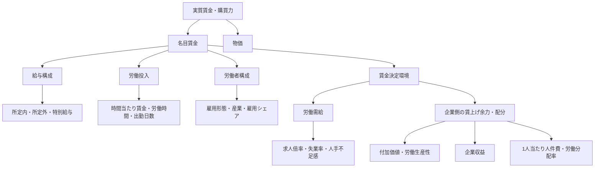

# 実質賃金関連分析：全体像と結論

作成日：2026-08-25
主分析期間：2015年平均から2025年平均
主な使用統計：

- 厚生労働省「毎月勤労統計調査」
- 総務省「消費者物価指数」
- 厚生労働省「一般職業紹介状況」
- 総務省「労働力調査」
- 日本銀行「全国企業短期経済観測調査」
- 財務省「法人企業統計調査」

---

## 1. この文書の目的

本プロジェクトでは、名目賃金と物価の推移を表示するだけでなく、次の問いを段階的に検証してきた。

> 「毎月勤労統計の5人以上事業所における平均名目賃金」に関係する変化を、名目賃金の構成、労働投入、労働者構成、労働需給、物価の各側面からどこまで説明できるか。

この文書は、個別分析で得られた結果を一つの説明体系に統合し、現時点での結論、分析から言えること、まだ言えないことを明確にするための概要文書である。数式、データ検証、実装方法、詳細な結果は各個別分析文書に記載する。

---

## 2. 現時点での全体結論

### 名目賃金の上昇

2015年から2025年にかけて、日本の名目賃金は広い産業で上昇した。現金給与総額の上昇は主として**所定内給与の増加**によって構成され、所定外給与の長期的な寄与は小さかった。
また、月額のきまって支給する給与を労働投入の面から分解すると、*概算時間当たり賃金*の上昇が月額賃金を押し上げる一方、総実労働時間の減少がその一部を相殺していた。

### 労働時間の減少

労働時間の減少は残業時間の減少だけではなく、主に**所定内労働時間の減少**によって生じていた。さらに所定内労働時間を分解すると、1出勤日当たりの勤務時間短縮ではなく、**月間出勤日数の減少**が中心だった。この傾向は一般労働者とパートタイム労働者の双方で確認された。

### 産業別分析

産業別には、**主要16産業すべてで月額賃金と概算時間当たり賃金が上昇し、総実労働時間が減少**した。したがって、全国平均で確認された「時間当たり賃金の上昇と労働時間の減少」という組み合わせは、一部産業だけによるものではない。ただし、各指標の変化幅には大きな産業差があった。

産業別の賃金と雇用シェアを用いた分解では、**平均賃金上昇の中心は各産業内の賃金上昇**だった。産業間の雇用構成変化は、2015年から2025年の平均賃金をわずかに押し下げる方向に作用しており、平均賃金上昇を牽引したとはいえない。

### 労働需給

労働需給については、**求人倍率、完全失業率を逼迫方向に変換した指標、短観の人手不足感と所定内給与上昇率の間に正の相関**が確認された。しかし、関係の強さと時間差は経済局面によって異なり、固定的な賃金反応期間は確認できなかった。
労働需給だけで近年の賃金上昇を説明することはできず、物価、春闘、最低賃金、生産性、企業収益、賃金改定行動なども検討する必要がある。

### 企業収益・生産性・労働分配

法人企業統計を用いて2015年度から2024年度の企業側の変化を確認すると、全産業・全規模では、付加価値は21.60%、労働生産性は12.69%上昇した。一方、1人当たり人件費の伸びは7.29%にとどまり、労働分配率は67.50%から64.22%へ3.27ポイント低下した。営業利益率は3.9%から5.0%、経常利益率は4.8%から6.8%へ上昇した。

特に2020年度から2024年度の回復局面では、労働生産性が18.75%上昇した一方、1人当たり人件費は6.66%の上昇にとどまり、労働分配率は7.27ポイント低下した。

企業規模別では、大企業ほど生産性と収益性の改善が大きかった一方、中小企業は労働分配率が高いにもかかわらず、生産性と1人当たり人件費の水準が低かった。このため、労働分配率の高さだけでは賃上げ余力を評価できず、付加価値・生産性の水準と合わせて考える必要がある。

毎月勤労統計との比較では、産業横断で労働生産性、1人当たり人件費、経常利益率と月額賃金上昇率の間に中程度の正相関がみられた。ただし、12産業と標本数が少なく、特定産業への感応度も高かった。

時系列では、労働生産性前年比と月額賃金前年比の同時点相関は0.823で、1年度ずつ除外しても0.757から0.908の範囲にあり比較的安定していた。一方、明確な1～2年のラグ構造や、生産性と時間当たり賃金の安定した関係は確認できなかった。

したがって、企業の生産性・収益性は賃上げ余力と関係する一方、その余力が同じ割合で人件費や賃金へ反映されるわけではない。

### 物価

物価を考慮すると、名目賃金の上昇がそのまま実質購買力の上昇につながったわけではない。雇用形態別の補助分析では、2015年から2025年の実質月額賃金は**一般労働者で2.9%減少し、パートタイム労働者で1.4%増加**した。一方、*実質概算時間当たり賃金*は一般労働者で2.0%、パートタイム労働者で14.2%上昇した。
したがって、実質賃金を評価する際には、月額か時間当たりか、就業形態、労働時間、使用するCPI系列を区別する必要がある。

---

## 3. 分析体系



分析結果は、次の3種類を区別して解釈する。

| 分析の種類         | 内容                                                   | 解釈できること                             |
| ------------------ | ------------------------------------------------------ | ------------------------------------------ |
| 恒等的・機械的分解 | 給与構成、賃金単価と労働時間、産業構成効果             | どの構成要素の変化が全体の変化を構成したか |
| 記述的比較         | 雇用形態別、産業別、時期別の比較                       | 対象間でどのような違いが観察されたか       |
| 統計的関連         | 労働需給指標、企業業績指標と賃金変化率の相関・ラグ相関 | 指標間にどの程度の関連があるか             |

恒等的分解であっても、構成要素が変化した原因までは示さない。相関分析は因果関係を示さない。

---

## 4. 共通する主分析条件

個別分析の比較可能性を高めるため、名目賃金側の主要な長期分析では原則として次の条件を使用した。

| 項目       | 条件                                               |
| ---------- | -------------------------------------------------- |
| 比較期間   | 2015年平均から2025年平均                           |
| 産業       | 調査産業計、または比較可能な主要16産業             |
| 事業所規模 | 5人以上                                            |
| 就業形態   | 就業形態計                                         |
| 賃金       | 現金給与総額、きまって支給する給与、各給与構成項目 |
| 労働時間   | 総実労働時間、所定内労働時間、所定外労働時間       |
| 集計       | 各年の12か月が揃った年平均                         |

2015年と2025年を使用した理由は、最新の完全な暦年までの10年間を比較し、単月の季節性や一時的変動を避けながら、コロナ前からコロナ期、回復期、近年の賃上げ局面を含む長期変化を確認するためである。

例外として、雇用形態比較では一般労働者とパートタイム労働者を分け、実質値にはCPI総合を使用した。労働需給分析では、月次指標について2000年1月から2025年12月、短観について2000年第1四半期から2025年第4四半期を使用した。

企業収益・生産性分析では、法人企業統計年次調査の2015年度から2024年度を使用した。全体分析では金融業・保険業を除く全産業・全規模を対象とし、企業規模別には資本金階層、産業別には毎月勤労統計と対応可能な12産業を使用した。

法人企業統計との時系列比較では、毎月勤労統計を4月から翌年3月までの年度平均へ再集計した。

---

## 5. 主要結果

| 分析                               | 主な結果                                                                                                                    | 分析上の意味                                                               |
| ---------------------------------- | --------------------------------------------------------------------------------------------------------------------------- | -------------------------------------------------------------------------- |
| 給与構成                           | 現金給与総額は12.72%増加。所定内給与+8.46pt、特別給与+4.22pt、所定外給与+0.04pt                                             | 総額上昇の最大の構成要素は**所定内給与**                                   |
| 労働投入                           | 月額のきまって支給する給与+10.30%、年間*加重概算時間当たり賃金*+17.95%、総実労働時間-6.49%                                  | 賃金単価上昇を労働時間減少が一部相殺                                       |
| 労働時間内訳                       | 総実労働時間-9.38時間のうち、所定内-8.20時間、所定外-1.18時間                                                               | 長期的な時間減少の中心は**所定内労働時間**                                 |
| 所定内労働時間                     | 出勤日数-6.56%、1出勤日当たり所定内労働時間+0.44%                                                                           | 所定内時間減少の中心は**出勤日数**                                         |
| 産業別                             | 16産業すべてで月額賃金・*概算時間当たり賃金*が上昇し、総実労働時間が減少                                                    | 全国平均の方向は主要産業に広く共通                                         |
| 産業間差                           | 月額賃金上昇率は約2.3%から32.3%                                                                                             | 上昇幅と調整構造には明確な**産業差**                                       |
| 産業構成                           | 平均賃金+10.30%、産業内賃金効果+10.66pt、産業構成効果-0.21pt、交差効果-0.15pt                                               | 平均賃金上昇の中心は各産業内の変化                                         |
| 雇用形態別実質月額賃金             | 一般労働者-2.9%、パートタイム労働者+1.4%                                                                                    | 名目賃金上昇の実質的効果は就業形態で異なる                                 |
| 雇用形態別実質*概算時間当たり賃金* | 一般労働者+2.0%、パートタイム労働者+14.2%                                                                                   | 月額と時間当たりでは実質評価が異なる                                       |
| 労働需給                           | 月次3指標の同時点相関は0.451から0.596、短観は0.579から0.639                                                                 | 人手不足と所定内給与上昇には正の関連がある                                 |
| 企業収益・生産性                   | 2015→2024年度で労働生産性+12.69%、1人当たり人件費+7.29%、労働分配率-3.27pt。2020→2024年度では生産性+18.75%、人件費/人+6.66% | 企業側の付加価値創出力・収益力の改善が同率で人件費へ反映されたわけではない |

---

## 6. 結果の統合

### 6.1 名目賃金上昇は一時的な残業増だけではない

現金給与総額の上昇に対する所定外給与の寄与は+0.04ptにとどまり、所定内給与の+8.46ptを大きく下回った。特別給与も+4.22pt寄与したが、長期上昇の最大の構成要素は所定内給与だった。
2020年には所定外給与と特別給与が給与総額を押し下げた一方、2022年以降、特に2024年以降は所定内給与が主要なプラス寄与となった。したがって、2020年の落ち込みと近年の上昇は、同じ給与構成では説明できない。

### 6.2 時間当たり賃金の伸びは月額賃金より大きい

月額のきまって支給する給与は10.30%増加した一方、*概算時間当たり賃金*は17.95%上昇した。この差は総実労働時間が6.49%減少したことと整合する。
対数変化の分解では、時間当たり賃金要因が+16.51、総実労働時間要因が-6.71だった。これは時間当たり賃金の上昇が月額賃金を押し上げ、労働時間の減少がその一部を相殺したことを示す。両者は定義上の関係に基づく分解であり、賃金単価や労働時間が変化した原因を示すものではない。

### 6.3 労働時間減少は残業時間だけでは説明できない

総実労働時間の減少幅の約87%は所定内労働時間の減少によるものだった。さらに、所定内労働時間の減少は主に出勤日数の減少から生じ、1出勤日当たり所定内労働時間はわずかに増加した。
一般労働者では出勤日数が4.63%、パートタイム労働者では12.22%減少しているため、就業形態計における出勤日数減少を雇用形態構成比の変化だけで説明することはできない。ただし、有給休暇、休日数、制度、属性構成などの影響は分離していない。

### 6.4 賃金上昇は広範だが均一ではない

主要16産業すべてで、概算時間当たり賃金の上昇と総実労働時間の減少が同時に確認された。一方、月額賃金上昇率は約2.3%から32.3%まで広がっており、全国平均だけでは産業ごとの調整幅を捉えられない。
*概算時間当たり賃金*要因と総実労働時間要因の産業間相関はPearsonで約-0.61、Spearmanで約-0.67だった。時間当たり賃金の上昇が大きい産業ほど労働時間の減少も大きい傾向がみられたが、16産業の探索的相関であり、因果関係は判断できない。

### 6.5 産業構成変化は平均賃金上昇の主因ではない

主要16産業の賃金を雇用シェアで加重した再構築平均賃金は、調査産業計をほぼ完全に再現した。その変化を分解すると、産業内賃金効果が+10.66ptであるのに対し、産業構成効果は-0.21pt、交差効果は-0.15ptだった。
したがって、2015年から2025年の平均賃金上昇は、高賃金産業の雇用シェアが上昇したことよりも、主として各産業内の平均賃金が上昇したことによって構成されていた。ただし、産業内賃金効果には雇用形態、年齢、性別、職種、事業所規模などの産業内構成変化が含まれるため、純粋な個人の賃金率上昇とは解釈しない。

### 6.6 人手不足は関連要因だが、単独の説明ではない

2000年以降の月次データでは、有効求人倍率、完全失業率を逼迫方向に変換した指標、新規求人倍率のすべてで、所定内給与前年比との正の同時点相関が確認された。短観の雇用人員判断DIでも、大企業・中堅企業・中小企業のすべてで比較的明確な正の相関が確認された。
一方、最大相関となるラグは指標、期間、変換方法によって安定しなかった。2013年から2019年には比較的明確な正の関係がみられたが、2022年以降は同時点の関係が弱い、または負となる局面もあった。したがって、人手不足は賃上げ圧力と整合的な関連要因だが、一定期間後の賃上げを機械的に予測する指標でも、近年の賃金上昇を単独で説明する要因でもない。

### 6.7 企業側の賃上げ余力は改善したが、人件費への反映は同程度ではない

2015年度から2024年度にかけて、法人企業統計では労働生産性が12.69%上昇した一方、1人当たり人件費の伸びは7.29%だった。特に2020年度から2024年度では、労働生産性+18.75%に対して1人当たり人件費+6.66%となり、労働分配率は7.27ポイント低下した。

企業規模別では、大企業ほど生産性と収益性の改善が強かった。一方、中小企業では労働分配率が高いにもかかわらず、生産性と1人当たり人件費の水準は低かった。したがって、「労働分配率が高いほど賃金も高い」という単純な関係ではない。

産業横断では、生産性や企業収益と月額賃金上昇率に一定の正相関がみられたが、12産業と標本数が少なく、外れた産業への感応度が高かった。

時系列では、労働生産性前年比と月額賃金前年比に比較的安定した正相関が確認された一方、1～2年遅れて賃金へ波及する明確なラグ構造は確認できなかった。

この結果は、

```text
人手不足
→ 賃上げ圧力

企業収益・生産性
→ 賃上げ余力

付加価値の配分
→ 実際の人件費・賃金
```

という複数段階で賃金決定を考える必要があることを示している。

### 6.8 実質購買力の評価は指標によって異なる

雇用形態別比較では、一般労働者・パートタイム労働者とも名目月額賃金と*概算時間当たり賃金*は上昇した。しかし、CPI総合で実質化すると、一般労働者の実質月額賃金は2.9%減少し、パートタイム労働者は1.4%の増加にとどまった。
一方、実質*概算時間当たり賃金*は一般労働者で2.0%、パートタイム労働者で14.2%上昇した。月額の購買力と時間当たりの購買力で結果が異なるのは、労働時間が減少しているためである。
この結果から、実質賃金を単一の数字として評価するのは適切ではない。少なくとも、月額か時間当たりか、一般労働者かパートタイム労働者か、どのCPI系列を使うかを明示する必要がある。

---

## 7. この分析体系から言えること

- 2015年から2025年の名目賃金上昇は、主として所定内給与の増加によって構成されていた。
- 月額賃金の伸びが概算時間当たり賃金の伸びより小さい背景には、総実労働時間の減少があった。
- 長期的な労働時間減少の中心は、所定外労働時間ではなく所定内労働時間だった。
- 所定内労働時間減少の中心は、1出勤日当たり時間ではなく出勤日数だった。
- 「時間当たり賃金上昇と労働時間減少」という組み合わせは主要産業に広く見られた。
- 平均賃金上昇の中心は産業構成変化ではなく、各産業内の賃金上昇だった。
- 労働需給の逼迫と所定内給与上昇には正の関連がある。
- 名目賃金上昇が実質月額賃金の上昇につながった程度は、就業形態によって異なる。
- 2015年度から2024年度にかけて、企業の労働生産性・収益性は改善した。
- 1人当たり人件費も上昇したが、労働生産性の伸びを下回り、労働分配率は低下した。
- 大企業では生産性・収益性の改善が特に大きく、中小企業では高い労働分配率と低い生産性・人件費水準が同時に確認された。
- 企業側指標と月額賃金には一定の関連があるが、産業や指標によって関係は異なる。
- 労働生産性前年比と月額賃金前年比の同時点の正相関は比較的安定していた。
- 企業業績から賃金への明確な1～2年ラグは確認できなかった。

---

## 8. この分析体系だけでは言えないこと

- 所定内給与が上昇した因果的な理由
- 出勤日数が減少した因果的な理由
- 個々の労働者が同じ仕事でどの程度賃上げされたか
- 平均値と中央値、賃金分布の各層がどのように変化したか
- 産業内賃金効果のうち、純粋な賃金率上昇と属性構成変化がそれぞれどの程度か
- 求人倍率の上昇が賃上げを直接引き起こしたか
- 最大相関ラグが企業の賃金決定期間を表すか
- 春闘、最低賃金、企業規模が近年の賃金上昇に与えた影響
- 特定の世帯または個人が経験した生活費上昇と実質購買力の変化
- 生産性や企業収益の上昇が賃金上昇を因果的に引き起こしたか
- 労働分配率の低下が企業の意図的な賃金抑制によるものか
- 個別企業で生産性・収益性の改善が賃金へどの程度還元されたか
- 産業横断で確認された相関が安定した一般則であるか
- 企業業績と賃金のラグ相関が企業の実際の賃金決定期間を表すか

---

## 9. 分析上の主な注意点

### 9.1 平均値の分析

毎月勤労統計の集計平均を用いており、同一人物の賃金変化や賃金分布を表すものではない。平均値は雇用形態、産業、年齢、性別、職種、事業所規模などの構成変化によっても動く。

### 9.2 _概算時間当たり賃金_

「きまって支給する給与 ÷ 総実労働時間」で算出した分析用の概算値であり、公的統計として公表される正式な時間当たり賃金ではない。

### 9.3 実質値

名目賃金を選択したCPIで除してアプリ内で算出した値であり、公的機関が公表する公式実質賃金指数と一致しない場合がある。CPI系列の選択によって結果は変わりうる。

### 9.4 分解と因果

給与構成、労働投入、産業構成の分解は、全体の変化をどの構成要素が作ったかを示す。各構成要素が変化した原因を示すものではない。労働需給分析は相関分析であり、因果効果を推定したものではない。

### 9.5 対象範囲

主分析は毎月勤労統計の5人以上事業所を対象とする。産業構成分析の雇用ウェイトも同統計の対象事業所に基づき、日本の全就業者を直接表すものではない。

### 9.6 法人企業統計と毎月勤労統計は同一概念ではない

法人企業統計の人件費は、役員給与、役員賞与、従業員給与、従業員賞与、福利厚生費を合計した企業側の労働コストであり、毎月勤労統計の賃金とは一致しない。

また、法人企業統計の全産業は金融業・保険業を除くため、毎月勤労統計の調査産業計と対象範囲が完全には一致しない。

企業規模についても、法人企業統計では資本金階層、毎月勤労統計では事業所規模、短観では独自の企業規模区分を使用しているため、完全に同一の企業群を比較しているわけではない。

さらに、産業横断分析は12産業、企業業績と賃金の時系列分析は最大9観測程度であり、相関係数は探索的な結果として解釈する。

---

## 10. 残された重要な分析課題

現時点の分析体系では、名目賃金の内部構造、労働需給、企業側の賃上げ余力・配分まで整理できた。

一方、実際の賃金改定から実質購買力までの説明を完成させるには、次の分析が重要である。

1. 実質賃金前年比を名目賃金要因とCPI要因に直接分解する。
2. 賃金引上げ等の実態に関する調査を用いて、企業の賃金改定行動を分析する。
3. 最低賃金とパートタイム労働者・低賃金産業の時間当たり賃金を接続する。
4. 春闘賃上げ率と所定内給与の関係を分析する。
5. 物価上昇から名目賃金への波及と時間差を分析する。
6. 賃金構造基本統計調査を用いて、平均値、中央値、分位、年齢、勤続年数等を分析する。
7. 費目別CPIを用いて、どの物価上昇が購買力を圧迫したかを限定的に整理する。

今後は分析項目を無制限に増やすのではなく、

> 実質賃金がなぜ上がりにくかったのかを説明するために、どの経路がまだ不足しているか

という観点から追加分析を選択する。

---

## 11. 個別分析文書

- [一般労働者・パートタイム労働者比較分析](01_employment_comparison.md)
- [給与構成の要因分解](02_wage_composition.md)
- [労働投入の要因分解](03_labor_input.md)
- [産業別賃金・労働時間分析](04_industry_wage.md)
- [産業構成効果分析](05_industry_composition.md)
- [労働需給と賃金分析](06_labor_market.md)
- [企業収益・生産性・労働分配率と賃金分析](07_corporate_performance.md)
- [賃金変動要因の分析ロードマップ](../planning/wage_analysis_roadmap.md)

---

## 12. 最終結論

2015年から2025年の日本の賃金変化について、現在の分析から最も強く言えるのは、名目賃金上昇は、給与項目側では主として所定内給与の増加によって構成され、労働投入側では*概算時間当たり賃金*の上昇が押上げ要因となっていたということである。

一方、総実労働時間、とりわけ出勤日数が減少したため、月額賃金の伸びは時間当たり賃金の伸びを下回った。また、物価上昇が名目賃金上昇の一部または全部を相殺したため、実質月額賃金の改善は就業形態によって異なり、一般労働者では2015年平均を下回った。

労働需給の逼迫は所定内給与上昇と正の関連を持つが、関係は時期によって変化し、近年の賃金上昇を単独では説明できない。したがって、現時点の到達点は「名目賃金のどの部分が、どの労働投入・産業構造の下で変化したか」をかなり明確に説明した段階であり、「なぜ賃金が上昇したのか」「なぜ実質購買力の改善が弱かったのか」を完全に因果説明した段階ではない。
