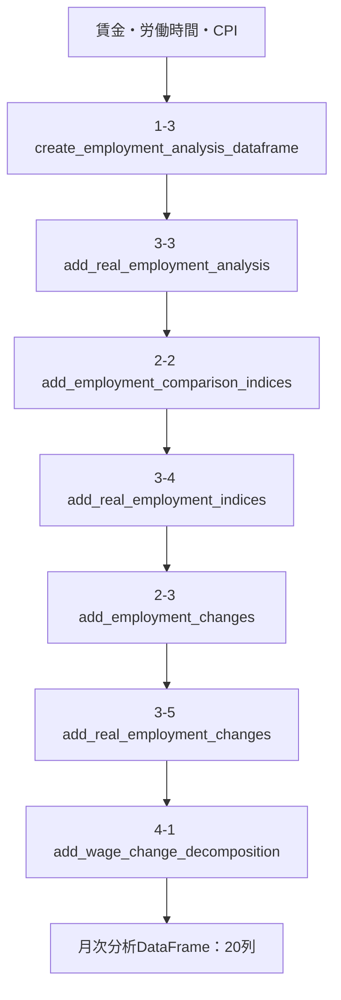
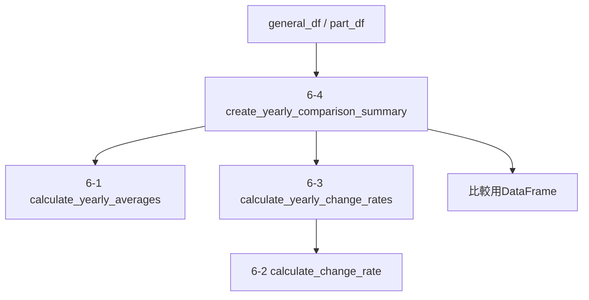
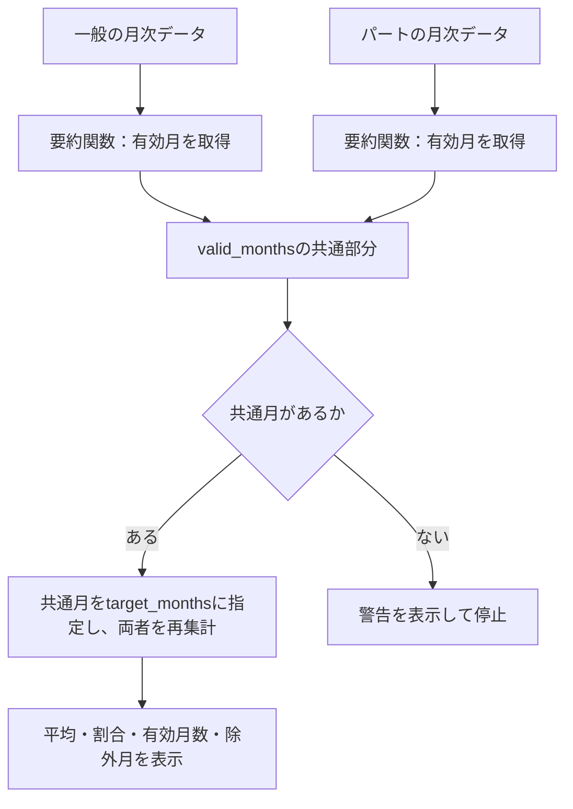

# `employment_analysis.py` コードフロー

対象: `src/real_wage_dashboard/employment_analysis.py`

## 1. このファイルの役割

`employment_analysis.py` は、一般労働者とパートタイム労働者の比較に必要な分析処理をまとめたモジュールです。

主な処理は次のとおりです。

1. 賃金の対象月を保持して労働時間を結合し、時間当たり賃金を計算する。
2. 同じ年月のCPIを結合し、実質値を計算する。
3. 名目・実質指標を基準年平均＝100で指数化する。
4. 年月を照合して、名目・実質指標の前年同月比を計算する。
5. 指標の整合性を確認し、月額賃金の前年同月対数変化を分解する。
6. 指定した2年の年平均と変化率を計算する。
7. 指定期間の月次分解を要約し、有効月・除外月を返す。

月次分析のパイプラインが実行するのは1〜5です。年次比較と期間要約は、呼び出し側が別途実行します。

自動考察の関数も残っていますが、現在のStreamlitページの考察は、記述日・対象条件を付した固定文章です。

---

## 2. 関数の並び

### 共通処理

- `_align_previous_year`

年月の欠損・重複を検証し、年月順に並べた当月データと、それぞれに対応する前年同月データを返します。前年同月が存在しない場合、その値は欠損になります。

次の3関数が使用します。

- `add_employment_changes`
- `add_real_employment_changes`
- `add_wage_change_decomposition`

### 1. 基礎データ作成

- `merge_wage_and_working_hours`
- `add_approx_hourly_wage`
- `create_employment_analysis_dataframe`

### 2. 名目指標の指数化・前年同月比

- `add_base_year_index`
- `add_employment_comparison_indices`
- `add_employment_changes`

### 3. CPI結合・実質値の作成

- `merge_employment_analysis_with_cpi`
- `add_real_employment_values`
- `add_real_employment_analysis`
- `add_real_employment_indices`
- `add_real_employment_changes`

### 4. 月額賃金変化の要因分解

- `add_wage_change_decomposition`

### 5. 月次分析パイプライン

- `create_full_employment_analysis_dataframe`

### 6. 年平均・期間変化の比較

- `calculate_yearly_averages`
- `calculate_change_rate`
- `calculate_yearly_change_rates`
- `create_yearly_comparison_summary`

### 7. 雇用形態間の比較・考察

- `compare_employment_change_rates`
- `describe_change_direction`
- `create_employment_analysis_discussion`

### 8. 要因分解の期間要約

- `summarize_wage_change_decomposition`

---

## 3. 月次分析のメインフロー

`create_full_employment_analysis_dataframe()`は、一つの就業形態について月次指標を作成します。一般・パートを比較する場合は、それぞれについて実行します。

以下は、DataFrameが各処理を通る順序です。

各段階で直接呼び出す関数は次のとおりです。

| パイプライン内の関数                   | 内部で呼び出す関数                                                  |
| -------------------------------------- | ------------------------------------------------------------------- |
| `create_employment_analysis_dataframe` | `merge_wage_and_working_hours` → `add_approx_hourly_wage`           |
| `add_real_employment_analysis`         | `merge_employment_analysis_with_cpi` → `add_real_employment_values` |
| `add_employment_comparison_indices`    | `add_base_year_index`を名目3指標について実行                        |
| `add_real_employment_indices`          | `add_base_year_index`を実質2指標について実行                        |
| `add_employment_changes`               | `_align_previous_year`                                              |
| `add_real_employment_changes`          | `_align_previous_year`                                              |
| `add_wage_change_decomposition`        | `_align_previous_year`                                              |

### 結合と欠損の扱い

賃金・労働時間・CPIは、年月を月初の日付にそろえて結合します。賃金と労働時間の結合、分析データとCPIの結合は、いずれも左結合です。賃金の対象月を保持し、対応する労働時間やCPIがない月は欠損を残します。

基準年は既定で2020年です。指数化する各指標について、基準年の12か月がそろい、正の有限値であることを確認します。基準年に必要な値が欠ける場合は、欠損のまま続行せずエラーになります。

### 前年同月比

12行前ではなく、年月で前年同月を検索します。前年同月の値が欠損している場合や0の場合、その指標の前年同月比は欠損になります。

### 月次分解の検証

`add_wage_change_decomposition()`では次を確認します。

- 観測された月額賃金・時間当たり賃金・労働時間が正の有限値である。
- 3指標がそろう行で、時間当たり賃金が月額賃金÷労働時間と一致する。
- 当月・前年同月の3指標がすべてそろっている。

時間当たり賃金の整合性確認には、`rtol=1e-10`、`atol=1e-10`を使用します。表示用に丸める前の値を入力します。

必要な値が欠ける月は、分解3列をすべて欠損にします。表示値は前年同月からの自然対数差×100であり、通常の前年同月比とは異なります。

### 出力列の内訳

| 区分                                         | 列数 |
| -------------------------------------------- | ---: |
| 年月・名目月額賃金・労働時間・時間当たり賃金 |    4 |
| CPI・実質2指標                               |    3 |
| 名目3指標・実質2指標の基準年指数             |    5 |
| 名目3指標・実質2指標の前年同月比             |    5 |
| 月額賃金の対数変化と分解2項                  |    3 |
| 合計                                         |   20 |

---

## 4. 年次比較のフロー

月次分析DataFrameから、指定した2年の年平均と変化率を求めます。

`create_yearly_comparison_summary()` は、一般労働者とパートタイム労働者について、

- 開始年の年平均
- 終了年の年平均
- 期間変化率

をまとめます。

`calculate_yearly_averages()`は、指定年について重複のない12か月がそろっていることと、対象指標に欠損・無限大がないことを確認します。各指標の月次値を単純平均し、利用可能な月だけの平均は算出しません。

`calculate_yearly_change_rates()`は、開始年・終了年の指標集合が一致することを確認し、各指標について`calculate_change_rate()`を呼びます。

`calculate_change_rate()`は、開始値・終了値が有限値であり、開始値が正であることを確認して期間変化率を計算します。

月次で算出した時間当たり賃金・実質値も、そのまま平均します。年平均の給与・時間・CPIから比率を再計算する処理は、この年次比較関数には含まれません。

比較結果は、就業形態×指標ごとに次の7列を持ちます。

- `employment_type`
- `indicator`
- `start_year`
- `start_value`
- `end_year`
- `end_value`
- `change_rate_pct`

---

## 5. Streamlitページからの利用

主な利用元は`pages/4_雇用形態比較.py`です。

| 分析関数                                    | ページでの用途                                                                    |
| ------------------------------------------- | --------------------------------------------------------------------------------- |
| `create_full_employment_analysis_dataframe` | ページ内の`create_analysis_dataframe()`を経由して、就業形態ごとの月次データを作成 |
| `create_yearly_comparison_summary`          | 一般・パートの年平均と期間変化率を作成                                            |
| `summarize_wage_change_decomposition`       | 分解可能月を確認し、共通月による期間要約を作成                                    |

### 共通月による期間要約

一般・パートで比較対象月をそろえる処理は、ページ側で行います。`summarize_wage_change_decomposition()`が自動で両者を照合するわけではありません。

通常の比較表示では、要約関数を一般・パートそれぞれについて有効月確認と共通月集計の2回、合計4回呼び出します。

### 固定の考察

ページの考察は、記述日と対象条件を付した固定文章です。現在の対象は、5人以上・CPI総合による2015年平均と2025年平均の比較です。

対象条件が一致しない場合は、その条件に対応する考察が未掲載であることを表示します。

`create_employment_analysis_discussion()`は、このページの考察表示では呼び出しません。

---

## 6. 月次分解の期間要約

`summarize_wage_change_decomposition()`は、一つの就業形態の分解データを受け取り、指定期間の平均・割合と対象月の情報を返します。

### 引数

| 引数            | 内容                                               |
| --------------- | -------------------------------------------------- |
| `df`            | 年月と分解3列を含むDataFrame                       |
| `start_year`    | 対象期間の開始年                                   |
| `end_year`      | 対象期間の終了年                                   |
| `target_months` | 集計対象月の文字列リスト。省略可能・キーワード専用 |

対象期間は、開始年の1月から終了年の12月までです。2015〜2025年の場合、想定月数は132か月になります。

### 処理と検証

1. 開始年・終了年の順序、必要列、年月の欠損・重複を確認する。
2. 対象期間の全月へ再配置し、存在しない月を欠損として扱う。
3. 対象期間の分解値に無限大があればエラーにする。
4. 分解3列がそろう月で、月額賃金の対数変化と2要因の合計を照合する。
5. `target_months`が指定されていれば、その月だけを選択する。
6. 有効な対象月がない場合はエラーにする。
7. 平均・割合・対象月の情報を返す。

分解の整合性確認には、`rtol=1e-10`、`atol=1e-8`を使用します。この検証は、`target_months`による絞り込みより前に行います。

指定月に欠損・重複・期間外の月・分解不能な月が含まれる場合もエラーになります。

### 戻り値

| キー                              | 内容                                                     |
| --------------------------------- | -------------------------------------------------------- |
| `n_expected_months`               | 対象期間の全月数                                         |
| `n_months`                        | 実際に集計した月数                                       |
| `n_excluded_months`               | 集計から除いた月数                                       |
| `valid_months`                    | 実際に集計した月の一覧                                   |
| `excluded_months`                 | 対象期間のうち集計しなかった月の一覧                     |
| `mean_wage_log_change`            | 月額賃金の対数変化の平均                                 |
| `mean_hourly_wage_contribution`   | 時間当たり賃金要因の平均                                 |
| `mean_working_hours_contribution` | 労働時間要因の平均                                       |
| `hourly_positive_share_pct`       | 時間当たり賃金要因が正の月の割合                         |
| `hours_negative_share_pct`        | 労働時間要因が負の月の割合                               |
| `hourly_dominant_share_pct`       | 時間当たり賃金要因の絶対値が労働時間要因を上回る月の割合 |

月の一覧は`YYYY-MM`形式です。`excluded_months`には、欠損等により集計できない月に加え、`target_months`で選択しなかった月も含まれます。

平均・割合の分母は、実際に集計した月数です。これらは前年同月対数変化の記述統計であり、年平均同士の長期変化への寄与や、因果的な説明力ではありません。

---

## 7. モジュールに残る比較・自動考察関数

以下の関数は実装されていますが、現在の雇用形態比較ページでは直接呼び出していません。

| 関数                                    | 現在の処理                                                               |
| --------------------------------------- | ------------------------------------------------------------------------ |
| `compare_employment_change_rates`       | 指標別に一般・パートを横持ちにし、パート－一般の変化率差と大小判定を返す |
| `describe_change_direction`             | 変化率を上昇・低下・横ばい・判定不可に分類する                           |
| `create_employment_analysis_discussion` | 年次比較結果から考察文のリストを生成する                                 |

`create_employment_analysis_discussion()`は内部で`describe_change_direction()`を呼び出します。`compare_employment_change_rates()`は呼び出しません。

比較関数の大小判定は符号付きの変化率を比較します。絶対的な変動幅や減少率の大きさを判定するものではありません。

方向判定の許容幅は既定で0.1です。比較関数の「同程度」は差が厳密に0の場合であり、方向判定・自動考察の許容幅とは異なります。

比較開始年・終了年の一致検証は、現時点では比較関数・自動考察関数に実装されていません。
