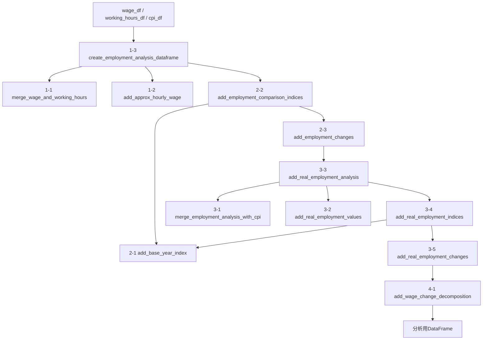
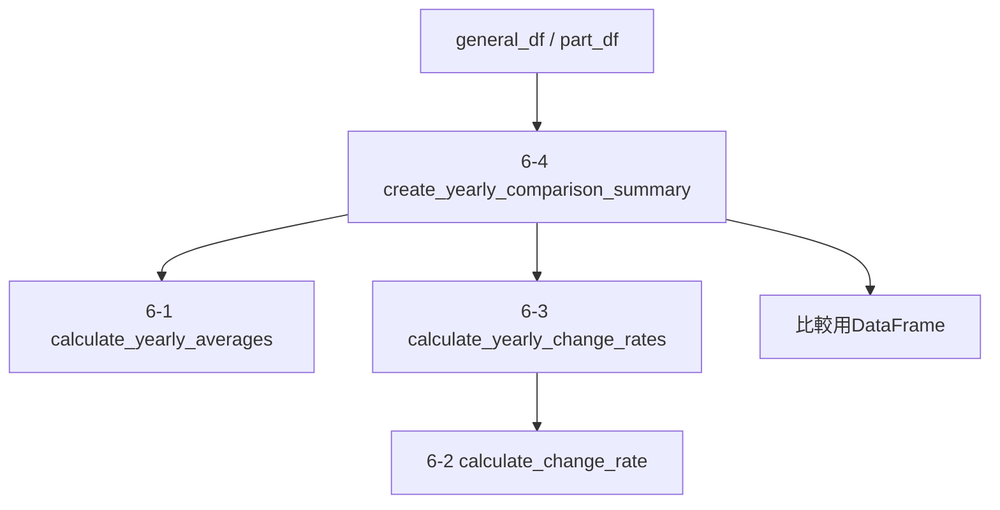
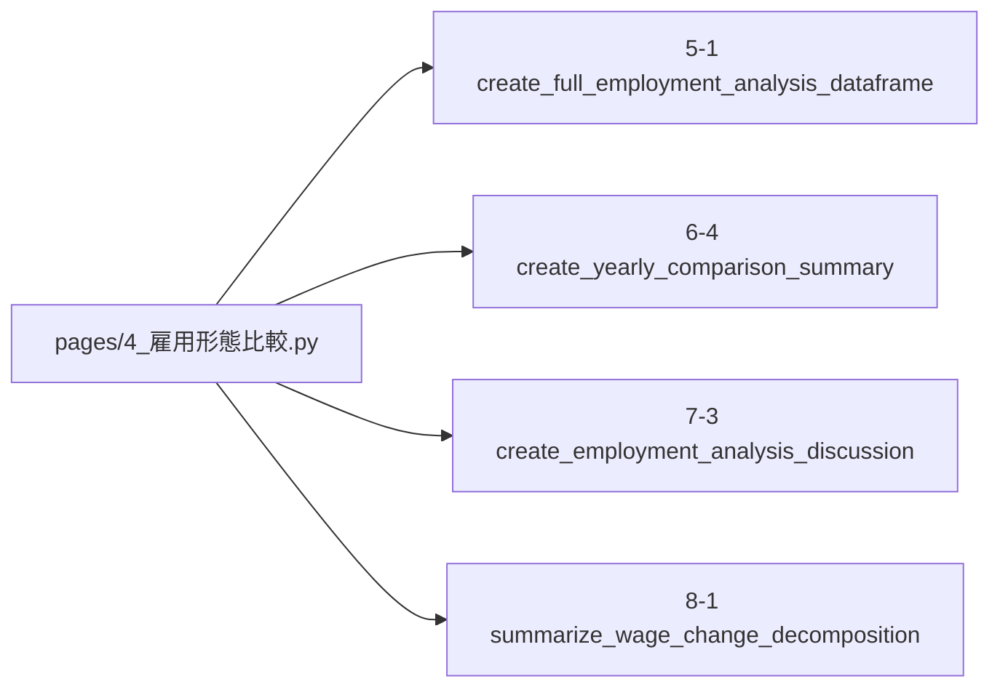

# `employment_analysis.py` コードフロー

対象: `src/real_wage_dashboard/employment_analysis.py`

## 1. このファイルの役割

`employment_analysis.py` は、一般労働者とパートタイム労働者の比較に必要な分析処理をまとめたモジュールです。

主な処理は次の流れです。

1. 賃金データと労働時間データを結合する
2. 概算時間当たり賃金を計算する
3. 名目指標を指数化し、前年同月比を計算する
4. CPIを結合して実質値を計算する
5. 実質指標を指数化し、前年同月比を計算する
6. 月額賃金変化を時間当たり賃金要因と労働時間要因に分解する
7. 年平均を使って一般労働者とパートタイム労働者を比較する
8. 比較結果から考察・要因分解の要約を作成する

---

## 2. 関数の並び

### 1. 基礎データ作成

- `merge_wage_and_working_hours`
- `add_approx_hourly_wage`
- `create_employment_analysis_dataframe`

### 2. 名目指標の指数化・前年同月比

- `add_base_year_index`
- `add_employment_comparison_indices`
- `add_employment_changes`

### 3. CPI結合・実質値の作成

- `merge_employment_analysis_with_cpi`
- `add_real_employment_values`
- `add_real_employment_analysis`
- `add_real_employment_indices`
- `add_real_employment_changes`

### 4. 月額賃金変化の要因分解

- `add_wage_change_decomposition`

### 5. 月次分析パイプライン

- `create_full_employment_analysis_dataframe`

### 6. 年平均・期間変化の比較

- `calculate_yearly_averages`
- `calculate_change_rate`
- `calculate_yearly_change_rates`
- `create_yearly_comparison_summary`

### 7. 雇用形態間の比較・考察

- `compare_employment_change_rates`
- `describe_change_direction`
- `create_employment_analysis_discussion`

### 8. 要因分解の期間要約

- `summarize_wage_change_decomposition`

---

## 3. 月次分析のメインフロー

`create_full_employment_analysis_dataframe()` が、月次分析処理の中心となる関数です。



実際の呼び出し順は次のとおりです。

```text
5-1 create_full_employment_analysis_dataframe
    ↓
1-3 create_employment_analysis_dataframe
    ├─ 1-1 merge_wage_and_working_hours
    └─ 1-2 add_approx_hourly_wage
    ↓
2-2 add_employment_comparison_indices
    └─ 2-1 add_base_year_index
    ↓
2-3 add_employment_changes
    ↓
3-3 add_real_employment_analysis
    ├─ 3-1 merge_employment_analysis_with_cpi
    └─ 3-2 add_real_employment_values
    ↓
3-4 add_real_employment_indices
    └─ 2-1* add_base_year_index
    ↓
3-5 add_real_employment_changes
    ↓
4-1 add_wage_change_decomposition
```

---

## 4. 年次比較のフロー

月次分析DataFrameから、指定した2年の年平均と変化率を求めます。



`create_yearly_comparison_summary()` は、一般労働者とパートタイム労働者について、

- 開始年の年平均
- 終了年の年平均
- 期間変化率

をまとめます。

---

## 5. Streamlitページからの利用

主な利用元は `pages/4_雇用形態比較.py` です。

ページ側から直接呼ばれる主な関数は次の4つです。



### `create_full_employment_analysis_dataframe`

一般労働者・パートタイム労働者それぞれの月次分析DataFrameを作成します。

### `create_yearly_comparison_summary`

2015年平均から2025年平均など、2時点間の変化を比較します。

### `create_employment_analysis_discussion`

年次比較結果から、賃金・労働時間・実質賃金の関係について考察文を生成します。

### `summarize_wage_change_decomposition`

月額賃金変化の要因分解を期間全体で要約します。

---

## 6. 補足

`compare_employment_change_rates()` と `describe_change_direction()` は分析関数として実装されていますが、現行の `pages/4_雇用形態比較.py` の主要処理では直接使用されていません。

そのため、コードを理解する段階では優先度を下げて読んでも問題ありません。
