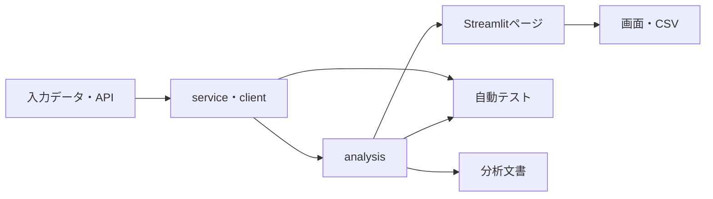

# 実装・テスト・分析文書対応表

## 1. この文書の目的

Real Wage Dashboardの各画面について、入力データ、データ処理、分析処理、テスト、分析文書の対応関係を整理する。

計算式は[指標・計算式の定義](metric_definitions.md)、共通する分析方法は[共通分析方法](methodology.md)、入力データは[データ出典・取得方法](data_sources.md)を参照する。

---

## 2. 基本構造

各層の基本的な役割は次のとおりである。

| 層         | 配置                    | 役割                                 |
| ---------- | ----------------------- | ------------------------------------ |
| 入力       | `data/raw/`、e-Stat API | 公表元から取得したデータ             |
| 外部通信   | `estat_client.py`       | e-Stat APIへの通信                   |
| データ処理 | `*_service.py`          | 読み込み、抽出、型変換、結合前の整形 |
| 分析処理   | `*_analysis.py`         | 指標計算、集計、分解、分析結果生成   |
| UI         | `app.py`、`pages/`      | 条件選択、グラフ、表、CSV出力        |
| テスト     | `tests/`                | データ処理と分析処理の検証           |
| 文書       | `docs/analysis/`        | 問い、条件、方法、結果、限界         |

Streamlitページへ複雑な計算を直接追加せず、再利用・検証が必要な処理はサービスまたは分析モジュールへ配置する。

---

## 3. 共通モジュール

| モジュール                 | 役割                                       | 主な利用先                  | 主なテスト                                 |
| -------------------------- | ------------------------------------------ | --------------------------- | ------------------------------------------ |
| `config.py`                | 統計表ID、系列コード、初期値、ファイルパス | 全ページ                    | 各機能テストから間接確認                   |
| `estat_client.py`          | e-Stat API通信とAPIエラー処理              | CPI、実質賃金、雇用形態比較 | 現時点では直接テストなし                   |
| `wage_service.py`          | 毎月勤労統計CSVの読み込みと条件抽出        | 名目・実質賃金、各賃金分析  | `test_wage_service.py`                     |
| `wage_analysis.py`         | 名目賃金の変化率と移動平均                 | 名目・実質賃金              | `test_wage_analysis.py`                    |
| `working_hours_service.py` | 労働時間系列の抽出                         | 雇用形態、労働投入、産業別  | `test_working_hours_service.py`            |
| `working_days_service.py`  | 出勤日数系列の抽出                         | 労働投入                    | `test_labor_input_analysis.py`から間接確認 |

---

## 4. 画面別対応表

| 画面             | UI                            | 主な分析処理                                               | データ処理・入力                                                                   | 主なテスト                                                                                           | 分析文書                       |
| ---------------- | ----------------------------- | ---------------------------------------------------------- | ---------------------------------------------------------------------------------- | ---------------------------------------------------------------------------------------------------- | ------------------------------ |
| 消費者物価指数   | `app.py`                      | `cpi_analysis.py`                                          | `estat_client.py`、`cpi_service.py`、e-Stat API                                    | `test_cpi_analysis.py`、`test_cpi_service.py`                                                        | `00_overview.md`、ルートREADME |
| 名目賃金         | `pages/2_名目賃金.py`         | `wage_analysis.py`                                         | `wage_service.py`、毎月勤労統計CSV                                                 | `test_wage_analysis.py`、`test_wage_service.py`                                                      | `00_overview.md`、ルートREADME |
| 実質賃金         | `pages/3_実質賃金.py`         | `real_wage_analysis.py`、`wage_analysis.py`                | `wage_service.py`、`cpi_service.py`、`estat_client.py`                             | `test_real_wage_analysis.py`、`test_wage_analysis.py`、`test_wage_service.py`、`test_cpi_service.py` | `00_overview.md`、ルートREADME |
| 雇用形態比較     | `pages/4_雇用形態比較.py`     | `employment_analysis.py`                                   | `wage_service.py`、`working_hours_service.py`、`cpi_service.py`、`estat_client.py` | `test_employment_analysis.py`、`test_working_hours_service.py`、`test_wage_service.py`               | `01_employment_comparison.md`  |
| 給与構成分析     | `pages/5_給与構成分析.py`     | `wage_composition_analysis.py`                             | `wage_service.py`                                                                  | `test_wage_composition_analysis.py`、`test_wage_service.py`                                          | `02_wage_composition.md`       |
| 労働投入分析     | `pages/6_労働投入分析.py`     | `labor_input_analysis.py`                                  | `wage_service.py`、`working_hours_service.py`、`working_days_service.py`           | `test_labor_input_analysis.py`、`test_working_hours_service.py`、`test_wage_service.py`              | `03_labor_input.md`            |
| 産業別分析       | `pages/7_産業別分析.py`       | `industry_analysis.py`                                     | `wage_service.py`、`working_hours_service.py`                                      | `test_industry_analysis.py`、`test_working_hours_service.py`、`test_wage_service.py`                 | `04_industry_wage.md`          |
| 産業構成効果分析 | `pages/8_産業構成効果分析.py` | `industry_composition_analysis.py`、`industry_analysis.py` | `wage_service.py`                                                                  | `test_industry_composition_analysis.py`、`test_industry_analysis.py`、`test_wage_service.py`         | `05_industry_composition.md`   |
| 労働需給分析     | `pages/9_労働需給分析.py`     | `labor_market_analysis.py`                                 | `labor_market_service.py`、`wage_service.py`、労働需給ファイル                     | `test_labor_market_analysis.py`、`test_labor_market_service.py`、`test_wage_service.py`              | `06_labor_market.md`           |

---

## 5. 個別分析文書と主要処理

### 5.1 雇用形態比較

| 項目         | 対応                                                        |
| ------------ | ----------------------------------------------------------- |
| 文書         | `docs/analysis/01_employment_comparison.md`                 |
| UI           | `pages/4_雇用形態比較.py`                                   |
| 中核処理     | `src/real_wage_dashboard/employment_analysis.py`            |
| 賃金抽出     | `src/real_wage_dashboard/wage_service.py`                   |
| 労働時間抽出 | `src/real_wage_dashboard/working_hours_service.py`          |
| CPI取得      | `src/real_wage_dashboard/estat_client.py`、`cpi_service.py` |
| 中核テスト   | `tests/test_employment_analysis.py`                         |

### 5.2 給与構成分析

| 項目       | 対応                                                   |
| ---------- | ------------------------------------------------------ |
| 文書       | `docs/analysis/02_wage_composition.md`                 |
| UI         | `pages/5_給与構成分析.py`                              |
| 中核処理   | `src/real_wage_dashboard/wage_composition_analysis.py` |
| 中核テスト | `tests/test_wage_composition_analysis.py`              |

### 5.3 労働投入分析

| 項目       | 対応                                              |
| ---------- | ------------------------------------------------- |
| 文書       | `docs/analysis/03_labor_input.md`                 |
| UI         | `pages/6_労働投入分析.py`                         |
| 中核処理   | `src/real_wage_dashboard/labor_input_analysis.py` |
| 労働時間   | `working_hours_service.py`                        |
| 出勤日数   | `working_days_service.py`                         |
| 中核テスト | `tests/test_labor_input_analysis.py`              |

### 5.4 産業別賃金・労働時間分析

| 項目       | 対応                                           |
| ---------- | ---------------------------------------------- |
| 文書       | `docs/analysis/04_industry_wage.md`            |
| UI         | `pages/7_産業別分析.py`                        |
| 中核処理   | `src/real_wage_dashboard/industry_analysis.py` |
| 中核テスト | `tests/test_industry_analysis.py`              |

### 5.5 産業構成効果分析

| 項目         | 対応                                                       |
| ------------ | ---------------------------------------------------------- |
| 文書         | `docs/analysis/05_industry_composition.md`                 |
| UI           | `pages/8_産業構成効果分析.py`                              |
| 中核処理     | `src/real_wage_dashboard/industry_composition_analysis.py` |
| 産業共通処理 | `src/real_wage_dashboard/industry_analysis.py`             |
| 中核テスト   | `tests/test_industry_composition_analysis.py`              |

### 5.6 労働需給と賃金分析

| 項目           | 対応                                                                        |
| -------------- | --------------------------------------------------------------------------- |
| 文書           | `docs/analysis/06_labor_market.md`                                          |
| UI             | `pages/9_労働需給分析.py`                                                   |
| 中核処理       | `src/real_wage_dashboard/labor_market_analysis.py`                          |
| 労働需給データ | `src/real_wage_dashboard/labor_market_service.py`                           |
| 賃金データ     | `src/real_wage_dashboard/wage_service.py`                                   |
| 中核テスト     | `tests/test_labor_market_analysis.py`、`tests/test_labor_market_service.py` |

---

## 6. 自動テストの対象範囲

現在の自動テストは、主にサービス層と分析層を対象とする。

確認対象：

- 入力列と条件抽出
- 欠損・重複・対象期間
- 変化率と移動平均
- 基準年指数
- 実質化
- 恒等式と要因分解
- 年平均と長期比較
- 雇用シェアと再構築平均
- 相関とラグ相関

次は直接の単体テストを持たない。

- `estat_client.py`
- `config.py`
- `working_days_service.py`
- Streamlitページの表示処理
- グラフ、折りたたみ表示、ダウンロード操作

これらは、関連する分析テストまたはUI手動確認から間接的に確認される。直接テストが必要かどうかは、変更頻度と不具合リスクを踏まえて判断する。

---

## 7. 変更時に更新する範囲

### 7.1 データ取得・抽出の変更

`*_service.py`または`estat_client.py`を変更した場合：

1. 対応するサービステスト
2. `data_sources.md`
3. 影響を受ける分析テスト
4. 分析期間・件数が変わる場合は個別分析文書

### 7.2 計算式・指標の変更

`*_analysis.py`を変更した場合：

1. 対応する分析テスト
2. `metric_definitions.md`
3. 対応する個別分析文書
4. 主要結論が変わる場合は`analysis/00_overview.md`

### 7.3 共通分析条件の変更

対象期間、事業所規模、就業形態、産業範囲を変更した場合：

1. `methodology.md`
2. 対応する個別分析文書
3. UI上の分析条件
4. 自動テスト
5. 主要結論が変わる場合は`analysis/00_overview.md`

### 7.4 UIの変更

Streamlitページを変更した場合：

1. UI手動確認
2. CSV出力列
3. 対応する個別分析文書
4. 機能一覧が変わる場合はルートREADME

### 7.5 新しい分析の追加

1. `src/real_wage_dashboard/`へサービス・分析処理を追加
2. `tests/`へ対応するテストを追加
3. `pages/`へ採用済み分析のUIを追加
4. `docs/analysis/`へ個別分析文書を追加
5. `docs/analysis/00_overview.md`へ主要結果を反映
6. `docs/README.md`と本書へ導線を追加
7. `docs/planning/wage_analysis_roadmap.md`の実施状況を更新

---

## 8. 更新ルール

次の場合は本書を更新する。

- ページを追加・削除した場合
- サービスまたは分析モジュールを追加・統合・分割した場合
- テストファイルを追加・削除した場合
- 個別分析文書を追加・改名した場合
- ページと分析処理の依存関係を変更した場合

軽微な関数追加まで逐次列挙せず、ページ、モジュール、テスト、文書の対応関係が変わる場合に更新する。
