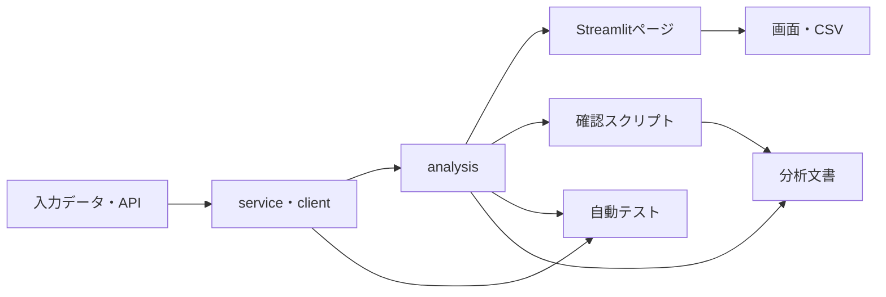

# 実装・テスト・分析文書対応表

## 1. この文書の目的

Real Wage Dashboardの各画面について、入力データ、データ処理、分析処理、テスト、分析文書の対応関係を整理する。

計算式は[指標・計算式の定義](metric_definitions.md)、共通する分析方法は[共通分析方法](methodology.md)、入力データは[データ出典・取得方法](data_sources.md)を参照する。

---

## 2. 基本構造



各層の基本的な役割は次のとおりである。

| 層         | 配置                    | 役割                                        |
| ---------- | ----------------------- | ------------------------------------------- |
| 入力       | `data/raw/`、e-Stat API | 公表元から取得したデータ                    |
| 外部通信   | `estat_client.py`       | e-Stat APIへの通信                          |
| データ処理 | `*_service.py`          | 読み込み、抽出、型変換、結合前の整形        |
| 分析処理   | `*_analysis.py`         | 指標計算、集計、分解、相関、分析結果生成    |
| 確認       | `scripts/check_*.py`    | データ探索、メタデータ確認、分析結果の検証  |
| UI         | `app.py`、`pages/`      | 採用済み分析の条件選択、グラフ、表、CSV出力 |
| テスト     | `tests/`                | データ処理と分析処理の自動検証              |
| 文書       | `docs/analysis/`        | 問い、条件、方法、結果、限界                |

Streamlitページへ複雑な計算を直接追加せず、再利用・検証が必要な処理はサービスまたは分析モジュールへ配置する。

また、分析価値を確認する前にすべての分析をUI化しない。

探索的・補助的な分析は、

```text
service
↓
analysis
↓
確認スクリプト
↓
分析文書
```

までで完結させることができる。

UI化は、分析結果がアプリ利用者に継続的な価値を持つと判断した場合に行う。

---

## 3. 共通モジュール

| モジュール                          | 役割                                                             | 主な利用先                                | 主なテスト                                 |
| ----------------------------------- | ---------------------------------------------------------------- | ----------------------------------------- | ------------------------------------------ |
| `config.py`                         | 統計表ID、系列コード、初期値、ファイルパス                       | 全ページ                                  | 各機能テストから間接確認                   |
| `estat_client.py`                   | e-Stat API通信とAPIエラー処理                                    | CPI、実質賃金、雇用形態比較、企業業績分析 | 現時点では直接テストなし                   |
| `wage_service.py`                   | 毎月勤労統計CSVの読み込みと条件抽出                              | 名目・実質賃金、各賃金分析                | `test_wage_service.py`                     |
| `wage_analysis.py`                  | 名目賃金の変化率と移動平均                                       | 名目・実質賃金                            | `test_wage_analysis.py`                    |
| `working_hours_service.py`          | 労働時間系列の抽出                                               | 雇用形態、労働投入、産業別                | `test_working_hours_service.py`            |
| `working_days_service.py`           | 出勤日数系列の抽出                                               | 労働投入                                  | `test_labor_input_analysis.py`から間接確認 |
| `corporate_performance_service.py`  | 法人企業統計APIデータの整形、企業業績指標・派生指標生成          | 企業業績・生産性・分配分析                | `test_corporate_performance_service.py`    |
| `corporate_performance_analysis.py` | 期間比較、企業規模別・産業別比較、賃金との結合、相関・感応度分析 | 企業業績・生産性・分配分析                | `test_corporate_performance_analysis.py`   |

---

## 4. 画面別対応表

| 画面             | UI                            | 主な分析処理                                               | データ処理・入力                                                                   | 主なテスト                                                                                           | 分析文書                       |
| ---------------- | ----------------------------- | ---------------------------------------------------------- | ---------------------------------------------------------------------------------- | ---------------------------------------------------------------------------------------------------- | ------------------------------ |
| 消費者物価指数   | `app.py`                      | `cpi_analysis.py`                                          | `estat_client.py`、`cpi_service.py`、e-Stat API                                    | `test_cpi_analysis.py`、`test_cpi_service.py`                                                        | `00_overview.md`、ルートREADME |
| 名目賃金         | `pages/2_名目賃金.py`         | `wage_analysis.py`                                         | `wage_service.py`、毎月勤労統計CSV                                                 | `test_wage_analysis.py`、`test_wage_service.py`                                                      | `00_overview.md`、ルートREADME |
| 実質賃金         | `pages/3_実質賃金.py`         | `real_wage_analysis.py`、`wage_analysis.py`                | `wage_service.py`、`cpi_service.py`、`estat_client.py`                             | `test_real_wage_analysis.py`、`test_wage_analysis.py`、`test_wage_service.py`、`test_cpi_service.py` | `00_overview.md`、ルートREADME |
| 雇用形態比較     | `pages/4_雇用形態比較.py`     | `employment_analysis.py`                                   | `wage_service.py`、`working_hours_service.py`、`cpi_service.py`、`estat_client.py` | `test_employment_analysis.py`、`test_working_hours_service.py`、`test_wage_service.py`               | `01_employment_comparison.md`  |
| 給与構成分析     | `pages/5_給与構成分析.py`     | `wage_composition_analysis.py`                             | `wage_service.py`                                                                  | `test_wage_composition_analysis.py`、`test_wage_service.py`                                          | `02_wage_composition.md`       |
| 労働投入分析     | `pages/6_労働投入分析.py`     | `labor_input_analysis.py`                                  | `wage_service.py`、`working_hours_service.py`、`working_days_service.py`           | `test_labor_input_analysis.py`、`test_working_hours_service.py`、`test_wage_service.py`              | `03_labor_input.md`            |
| 産業別分析       | `pages/7_産業別分析.py`       | `industry_analysis.py`                                     | `wage_service.py`、`working_hours_service.py`                                      | `test_industry_analysis.py`、`test_working_hours_service.py`、`test_wage_service.py`                 | `04_industry_wage.md`          |
| 産業構成効果分析 | `pages/8_産業構成効果分析.py` | `industry_composition_analysis.py`、`industry_analysis.py` | `wage_service.py`                                                                  | `test_industry_composition_analysis.py`、`test_industry_analysis.py`、`test_wage_service.py`         | `05_industry_composition.md`   |
| 労働需給分析     | `pages/9_労働需給分析.py`     | `labor_market_analysis.py`                                 | `labor_market_service.py`、`wage_service.py`、労働需給ファイル                     | `test_labor_market_analysis.py`、`test_labor_market_service.py`、`test_wage_service.py`              | `06_labor_market.md`           |

---

## 5. UI化していない分析

すべての分析をStreamlitページとして実装する必要はない。

探索的分析、分析体系を補完する分析、画面化する価値をまだ評価中の分析については、分析モジュール・確認スクリプト・分析文書までを実装単位とする。

| 分析                   | 主な分析処理                        | データ処理・入力                                                                          | 確認スクリプト         | 主なテスト                                                                        | 分析文書                      |
| ---------------------- | ----------------------------------- | ----------------------------------------------------------------------------------------- | ---------------------- | --------------------------------------------------------------------------------- | ----------------------------- |
| 企業業績・生産性・分配 | `corporate_performance_analysis.py` | `corporate_performance_service.py`、`estat_client.py`、法人企業統計API、`wage_service.py` | `check_corporate_*.py` | `test_corporate_performance_analysis.py`、`test_corporate_performance_service.py` | `07_corporate_performance.md` |

企業業績分析では、

- 法人企業統計のメタデータ確認
- データ取得可能性
- 長期欠損確認
- 企業規模別比較
- 産業別比較
- 毎月勤労統計との接続
- 時系列相関
- ラグ相関
- Leave-One-Outによる感応度確認

を確認スクリプトから実施する。

UI化する場合も、既存の `corporate_performance_service.py` と `corporate_performance_analysis.py` を再利用し、ページへ分析ロジックを重複実装しない。

---

## 6. 個別分析文書と主要処理

### 6.1 雇用形態比較

| 項目         | 対応                                                        |
| ------------ | ----------------------------------------------------------- |
| 文書         | `docs/analysis/01_employment_comparison.md`                 |
| UI           | `pages/4_雇用形態比較.py`                                   |
| 中核処理     | `src/real_wage_dashboard/employment_analysis.py`            |
| 賃金抽出     | `src/real_wage_dashboard/wage_service.py`                   |
| 労働時間抽出 | `src/real_wage_dashboard/working_hours_service.py`          |
| CPI取得      | `src/real_wage_dashboard/estat_client.py`、`cpi_service.py` |
| 中核テスト   | `tests/test_employment_analysis.py`                         |

### 6.2 給与構成分析

| 項目       | 対応                                                   |
| ---------- | ------------------------------------------------------ |
| 文書       | `docs/analysis/02_wage_composition.md`                 |
| UI         | `pages/5_給与構成分析.py`                              |
| 中核処理   | `src/real_wage_dashboard/wage_composition_analysis.py` |
| 中核テスト | `tests/test_wage_composition_analysis.py`              |

### 6.3 労働投入分析

| 項目       | 対応                                              |
| ---------- | ------------------------------------------------- |
| 文書       | `docs/analysis/03_labor_input.md`                 |
| UI         | `pages/6_労働投入分析.py`                         |
| 中核処理   | `src/real_wage_dashboard/labor_input_analysis.py` |
| 労働時間   | `working_hours_service.py`                        |
| 出勤日数   | `working_days_service.py`                         |
| 中核テスト | `tests/test_labor_input_analysis.py`              |

### 6.4 産業別賃金・労働時間分析

| 項目       | 対応                                           |
| ---------- | ---------------------------------------------- |
| 文書       | `docs/analysis/04_industry_wage.md`            |
| UI         | `pages/7_産業別分析.py`                        |
| 中核処理   | `src/real_wage_dashboard/industry_analysis.py` |
| 中核テスト | `tests/test_industry_analysis.py`              |

### 6.5 産業構成効果分析

| 項目         | 対応                                                       |
| ------------ | ---------------------------------------------------------- |
| 文書         | `docs/analysis/05_industry_composition.md`                 |
| UI           | `pages/8_産業構成効果分析.py`                              |
| 中核処理     | `src/real_wage_dashboard/industry_composition_analysis.py` |
| 産業共通処理 | `src/real_wage_dashboard/industry_analysis.py`             |
| 中核テスト   | `tests/test_industry_composition_analysis.py`              |

### 6.6 労働需給と賃金分析

| 項目           | 対応                                                                        |
| -------------- | --------------------------------------------------------------------------- |
| 文書           | `docs/analysis/06_labor_market.md`                                          |
| UI             | `pages/9_労働需給分析.py`                                                   |
| 中核処理       | `src/real_wage_dashboard/labor_market_analysis.py`                          |
| 労働需給データ | `src/real_wage_dashboard/labor_market_service.py`                           |
| 賃金データ     | `src/real_wage_dashboard/wage_service.py`                                   |
| 中核テスト     | `tests/test_labor_market_analysis.py`、`tests/test_labor_market_service.py` |

### 6.7 企業業績・生産性・分配分析

| 項目             | 対応                                                                                          |
| ---------------- | --------------------------------------------------------------------------------------------- |
| 文書             | `docs/analysis/07_corporate_performance.md`                                                   |
| UI               | 現時点ではなし                                                                                |
| データ取得・整形 | `src/real_wage_dashboard/corporate_performance_service.py`                                    |
| 中核処理         | `src/real_wage_dashboard/corporate_performance_analysis.py`                                   |
| e-Stat通信       | `src/real_wage_dashboard/estat_client.py`                                                     |
| 賃金データ       | `src/real_wage_dashboard/wage_service.py`                                                     |
| 設定             | `src/real_wage_dashboard/config.py`                                                           |
| 中核テスト       | `tests/test_corporate_performance_analysis.py`、`tests/test_corporate_performance_service.py` |

主な確認スクリプト：

```text
scripts/check_corporate_stats_metadata.py
scripts/check_corporate_performance_data.py
scripts/check_corporate_performance_comparison.py
scripts/check_corporate_performance_by_capital_class.py
scripts/check_corporate_performance_by_industry.py
scripts/check_corporate_wage_industry_relationship.py
scripts/check_corporate_wage_time_series.py
scripts/check_corporate_long_term_availability.py
```

この分析では、データ取得・派生指標生成と分析処理を明確に分離する。

```text
corporate_performance_service.py
    ↓
法人企業統計の取得・整形・派生指標
    ↓
corporate_performance_analysis.py
    ↓
期間比較・規模別・産業別・時系列分析
    ↓
scripts/check_*.py
    ↓
docs/analysis/07_corporate_performance.md
```

現時点では分析文書を成果物とし、Streamlitページへの追加は行っていない。

---

## 7. 自動テストの対象範囲

現在の自動テストは、主にサービス層と分析層を対象とする。

確認対象：

- 入力列と条件抽出
- 欠損・重複・対象期間
- 変化率と移動平均
- 基準年指数
- 実質化
- 恒等式と要因分解
- 年平均・年度集計と長期比較
- 雇用シェアと再構築平均
- 法人企業統計のAPIレスポンス変換
- 人件費・1人当たり人件費・労働分配率等の派生指標
- 企業規模別・産業別比較データ生成
- 毎月勤労統計と法人企業統計の年度結合
- 相関とラグ相関
- Leave-One-Out等の感応度分析

次は直接の単体テストを持たない。

- `estat_client.py`
- `config.py`
- `working_days_service.py`
- Streamlitページの表示処理
- グラフ、折りたたみ表示、ダウンロード操作

これらは、関連する分析テストまたはUI手動確認から間接的に確認される。直接テストが必要かどうかは、変更頻度と不具合リスクを踏まえて判断する。

---

## 8. 変更時に更新する範囲

### 8.1 データ取得・抽出の変更

`*_service.py`または`estat_client.py`を変更した場合：

1. 対応するサービステスト
2. `data_sources.md`
3. 影響を受ける分析テスト
4. 分析期間・件数が変わる場合は個別分析文書

### 8.2 計算式・指標の変更

`*_analysis.py`を変更した場合：

1. 対応する分析テスト
2. `metric_definitions.md`
3. 対応する個別分析文書
4. 主要結論が変わる場合は`analysis/00_overview.md`

### 8.3 共通分析条件の変更

対象期間、事業所規模、就業形態、産業範囲を変更した場合：

1. `methodology.md`
2. 対応する個別分析文書
3. UI上の分析条件
4. 自動テスト
5. 主要結論が変わる場合は`analysis/00_overview.md`

### 8.4 UIの変更

Streamlitページを変更した場合：

1. UI手動確認
2. CSV出力列
3. 対応する個別分析文書
4. 機能一覧が変わる場合はルートREADME

### 8.5 新しい分析の追加

1. 必要に応じて `src/real_wage_dashboard/` へサービス処理を追加する。
2. `src/real_wage_dashboard/` へ分析処理を追加する。
3. `scripts/` へ探索・検証用の確認スクリプトを追加する。
4. `tests/` へ対応する自動テストを追加する。
5. `docs/analysis/` へ個別分析文書を追加する。
6. 主要結論を `docs/analysis/00_overview.md` へ反映する。
7. `docs/reference/` のデータ・指標・方法・実装マップを更新する。
8. `docs/README.md` へ分析文書への導線を追加する。
9. `docs/planning/wage_analysis_roadmap.md` の実施状況を更新する。
10. 分析価値が確認でき、継続的に操作する価値がある場合のみ `pages/` へUIを追加する。
11. UIを追加した場合はルート `README.md` の機能一覧も更新する。

新しい分析を追加しただけでは、Streamlitページの作成を必須としない。

---

## 9. 更新ルール

次の場合は本書を更新する。

- ページを追加・削除した場合
- サービスまたは分析モジュールを追加・統合・分割した場合
- テストファイルを追加・削除した場合
- 個別分析文書を追加・改名した場合
- ページと分析処理の依存関係を変更した場合

軽微な関数追加まで逐次列挙せず、ページ、モジュール、テスト、文書の対応関係が変わる場合に更新する。
