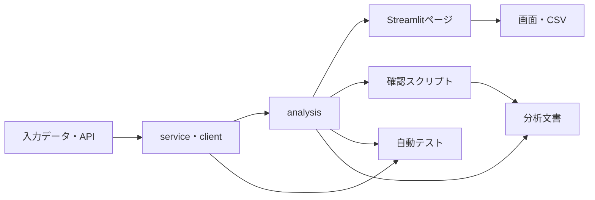

# 実装・テスト・分析文書対応表

## 1. この文書の目的

Real Wage Dashboard の各画面・分析について、入力データ、データ処理、分析処理、確認スクリプト、テスト、分析文書の対応関係を整理する。

計算式は [指標・計算式の定義](metric_definitions.md)、共通する分析方法は [共通分析方法](methodology.md)、入力データは [データ出典・取得方法](data_sources.md) を参照する。

---

## 2. 基本構造



各層の基本的な役割は次のとおりである。

| 層         | 配置                    | 役割                                     |
| ---------- | ----------------------- | ---------------------------------------- |
| 入力       | `data/raw/`、e-Stat API | 公表元から取得したデータ                 |
| 外部通信   | `estat_client.py`       | e-Stat APIへの通信                       |
| データ処理 | `*_service.py`          | 読み込み、抽出、型変換、結合前の整形     |
| 分析処理   | `*_analysis.py`         | 指標計算、集計、分解、相関、分析結果生成 |
| 確認       | `scripts/check_*.py`    | 実データ、メタデータ、分析結果の検証     |
| UI         | `app.py`、`pages/`      | 条件選択、グラフ、表、CSV出力            |
| テスト     | `tests/`                | データ処理と分析処理の自動検証           |
| 文書       | `docs/analysis/`        | 問い、条件、方法、結果、限界             |

Streamlitページへ複雑な計算を直接追加せず、再利用・検証が必要な処理はサービスまたは分析モジュールへ配置する。

分析価値を確認する前に、すべての分析をUI化する必要はない。

探索的・補助的な分析は、

```text
service / input
↓
analysis
↓
確認スクリプト
↓
テスト
↓
分析文書
```

までで完結させることができる。

---

## 3. 共通モジュール

| モジュール                            | 役割                                               | 主な利用先                               | 主なテスト                                 |
| ------------------------------------- | -------------------------------------------------- | ---------------------------------------- | ------------------------------------------ |
| `config.py`                           | 統計表ID、系列コード、初期値、ファイルパス         | 全体                                     | 各機能テストから間接確認                   |
| `estat_client.py`                     | e-Stat API通信とAPIエラー処理                      | CPI、法人企業統計                        | 直接テストなし                             |
| `wage_service.py`                     | 毎月勤労統計CSVの読み込みと条件抽出                | 名目・実質賃金、各賃金分析               | `test_wage_service.py`                     |
| `wage_analysis.py`                    | 名目賃金の変化率と移動平均                         | 名目・実質賃金                           | `test_wage_analysis.py`                    |
| `working_hours_service.py`            | 労働時間系列の抽出                                 | 雇用形態、労働投入、産業別、事業所規模別 | `test_working_hours_service.py`            |
| `working_days_service.py`             | 出勤日数系列の抽出                                 | 労働投入                                 | `test_labor_input_analysis.py`から間接確認 |
| `time_series.py`                      | 時系列の共通処理                                   | 複数分析                                 | 関連分析テストから間接確認                 |
| `corporate_performance_service.py`    | 法人企業統計APIデータの整形、企業業績指標生成      | 企業業績分析                             | `test_corporate_performance_service.py`    |
| `corporate_performance_analysis.py`   | 期間比較、規模別・産業別比較、賃金との結合、相関等 | 企業業績分析                             | `test_corporate_performance_analysis.py`   |
| `wage_revision_service.py`            | 賃金引上げ等の実態に関する調査の読み込み・整形     | 賃金改定行動分析                         | `test_wage_revision_service.py`            |
| `wage_revision_analysis.py`           | 改定率、実施状況、重視要因等の比較                 | 賃金改定行動分析                         | `test_wage_revision_analysis.py`           |
| `real_wage_decomposition_analysis.py` | 名目賃金・物価・実質賃金の連鎖・分解               | 実質賃金要因分解                         | `test_real_wage_decomposition_analysis.py` |
| `establishment_size_wage_analysis.py` | 5人以上・30人以上系列の比較、規模差の分解          | 事業所規模別賃金分析                     | `test_establishment_size_wage_analysis.py` |

---

## 4. UI化している分析

| 画面             | UI                            | 主な分析処理                                               | データ処理・入力                                                         | 主なテスト                                                                                           | 分析文書                      |
| ---------------- | ----------------------------- | ---------------------------------------------------------- | ------------------------------------------------------------------------ | ---------------------------------------------------------------------------------------------------- | ----------------------------- |
| 消費者物価指数   | `app.py`                      | `cpi_analysis.py`                                          | `estat_client.py`、`cpi_service.py`                                      | `test_cpi_analysis.py`、`test_cpi_service.py`                                                        | `00_overview.md`              |
| 名目賃金         | `pages/2_名目賃金.py`         | `wage_analysis.py`                                         | `wage_service.py`                                                        | `test_wage_analysis.py`、`test_wage_service.py`                                                      | `00_overview.md`              |
| 実質賃金         | `pages/3_実質賃金.py`         | `real_wage_analysis.py`、`wage_analysis.py`                | `wage_service.py`、`cpi_service.py`、`estat_client.py`                   | `test_real_wage_analysis.py`、`test_wage_analysis.py`、`test_wage_service.py`、`test_cpi_service.py` | `00_overview.md`              |
| 雇用形態比較     | `pages/4_雇用形態比較.py`     | `employment_analysis.py`                                   | `wage_service.py`、`working_hours_service.py`、`cpi_service.py`          | `test_employment_analysis.py`、`test_working_hours_service.py`、`test_wage_service.py`               | `01_employment_comparison.md` |
| 給与構成分析     | `pages/5_給与構成分析.py`     | `wage_composition_analysis.py`                             | `wage_service.py`                                                        | `test_wage_composition_analysis.py`、`test_wage_service.py`                                          | `02_wage_composition.md`      |
| 労働投入分析     | `pages/6_労働投入分析.py`     | `labor_input_analysis.py`                                  | `wage_service.py`、`working_hours_service.py`、`working_days_service.py` | `test_labor_input_analysis.py`、`test_working_hours_service.py`、`test_wage_service.py`              | `03_labor_input.md`           |
| 産業別分析       | `pages/7_産業別分析.py`       | `industry_analysis.py`                                     | `wage_service.py`、`working_hours_service.py`                            | `test_industry_analysis.py`、`test_working_hours_service.py`、`test_wage_service.py`                 | `04_industry_wage.md`         |
| 産業構成効果分析 | `pages/8_産業構成効果分析.py` | `industry_composition_analysis.py`、`industry_analysis.py` | `wage_service.py`                                                        | `test_industry_composition_analysis.py`、`test_industry_analysis.py`、`test_wage_service.py`         | `05_industry_composition.md`  |
| 労働需給分析     | `pages/9_労働需給分析.py`     | `labor_market_analysis.py`                                 | `labor_market_service.py`、`wage_service.py`                             | `test_labor_market_analysis.py`、`test_labor_market_service.py`、`test_wage_service.py`              | `06_labor_market.md`          |

---

## 5. UI化していない分析

UI化していない分析も、分析モジュール・確認スクリプト・テスト・分析文書までを正式な成果物とする。

| 分析                             | 主な分析処理                          | データ処理・入力                                                                          | 主な確認スクリプト                       | 主なテスト                                                                        | 分析文書                        |
| -------------------------------- | ------------------------------------- | ----------------------------------------------------------------------------------------- | ---------------------------------------- | --------------------------------------------------------------------------------- | ------------------------------- |
| 企業業績・生産性・分配           | `corporate_performance_analysis.py`   | `corporate_performance_service.py`、`estat_client.py`、法人企業統計API、`wage_service.py` | `check_corporate_*.py`                   | `test_corporate_performance_analysis.py`、`test_corporate_performance_service.py` | `07_corporate_performance.md`   |
| 賃金改定行動                     | `wage_revision_analysis.py`           | `wage_revision_service.py`、賃金引上げ等の実態に関する調査                                | `check_wage_revision_*.py`               | `test_wage_revision_analysis.py`、`test_wage_revision_service.py`                 | `08_wage_revision.md`           |
| 実質賃金の名目賃金・物価要因分解 | `real_wage_decomposition_analysis.py` | 毎月勤労統計の指数・増減率、公表実質賃金系列、CPI系列                                     | `check_real_wage_decomposition_index.py` | `test_real_wage_decomposition_analysis.py`                                        | `09_real_wage_decomposition.md` |
| 事業所規模別賃金                 | `establishment_size_wage_analysis.py` | `wage_service.py`、`working_hours_service.py`、毎月勤労統計5人以上・30人以上系列          | `check_establishment_size_wage.py`       | `test_establishment_size_wage_analysis.py`                                        | `10_establishment_size_wage.md` |

UI化の有無は分析の完成度とは別に判断する。

次の条件を満たす場合にUI化を検討する。

- 利用者が条件を切り替えて継続的に確認する価値がある。
- データ更新頻度が高い。
- グラフ・表による反復的な探索が有効である。
- 既存ページとの重複が少ない。
- UI追加による保守コストを上回る価値がある。

---

## 6. 個別分析文書と主要処理

### 6.1 雇用形態比較

| 項目         | 対応                                                        |
| ------------ | ----------------------------------------------------------- |
| 文書         | `docs/analysis/01_employment_comparison.md`                 |
| UI           | `pages/4_雇用形態比較.py`                                   |
| 中核処理     | `src/real_wage_dashboard/employment_analysis.py`            |
| 賃金抽出     | `src/real_wage_dashboard/wage_service.py`                   |
| 労働時間抽出 | `src/real_wage_dashboard/working_hours_service.py`          |
| CPI取得      | `src/real_wage_dashboard/estat_client.py`、`cpi_service.py` |
| 中核テスト   | `tests/test_employment_analysis.py`                         |

### 6.2 給与構成分析

| 項目       | 対応                                                   |
| ---------- | ------------------------------------------------------ |
| 文書       | `docs/analysis/02_wage_composition.md`                 |
| UI         | `pages/5_給与構成分析.py`                              |
| 中核処理   | `src/real_wage_dashboard/wage_composition_analysis.py` |
| 中核テスト | `tests/test_wage_composition_analysis.py`              |

### 6.3 労働投入分析

| 項目       | 対応                                              |
| ---------- | ------------------------------------------------- |
| 文書       | `docs/analysis/03_labor_input.md`                 |
| UI         | `pages/6_労働投入分析.py`                         |
| 中核処理   | `src/real_wage_dashboard/labor_input_analysis.py` |
| 労働時間   | `working_hours_service.py`                        |
| 出勤日数   | `working_days_service.py`                         |
| 中核テスト | `tests/test_labor_input_analysis.py`              |

### 6.4 産業別賃金・労働時間分析

| 項目       | 対応                                           |
| ---------- | ---------------------------------------------- |
| 文書       | `docs/analysis/04_industry_wage.md`            |
| UI         | `pages/7_産業別分析.py`                        |
| 中核処理   | `src/real_wage_dashboard/industry_analysis.py` |
| 中核テスト | `tests/test_industry_analysis.py`              |

### 6.5 産業構成効果分析

| 項目         | 対応                                                       |
| ------------ | ---------------------------------------------------------- |
| 文書         | `docs/analysis/05_industry_composition.md`                 |
| UI           | `pages/8_産業構成効果分析.py`                              |
| 中核処理     | `src/real_wage_dashboard/industry_composition_analysis.py` |
| 産業共通処理 | `src/real_wage_dashboard/industry_analysis.py`             |
| 中核テスト   | `tests/test_industry_composition_analysis.py`              |

### 6.6 労働需給と賃金分析

| 項目           | 対応                                                                        |
| -------------- | --------------------------------------------------------------------------- |
| 文書           | `docs/analysis/06_labor_market.md`                                          |
| UI             | `pages/9_労働需給分析.py`                                                   |
| 中核処理       | `src/real_wage_dashboard/labor_market_analysis.py`                          |
| 労働需給データ | `src/real_wage_dashboard/labor_market_service.py`                           |
| 賃金データ     | `src/real_wage_dashboard/wage_service.py`                                   |
| 中核テスト     | `tests/test_labor_market_analysis.py`、`tests/test_labor_market_service.py` |

### 6.7 企業業績・生産性・分配分析

| 項目             | 対応                                                                                          |
| ---------------- | --------------------------------------------------------------------------------------------- |
| 文書             | `docs/analysis/07_corporate_performance.md`                                                   |
| UI               | なし                                                                                          |
| データ取得・整形 | `src/real_wage_dashboard/corporate_performance_service.py`                                    |
| 中核処理         | `src/real_wage_dashboard/corporate_performance_analysis.py`                                   |
| e-Stat通信       | `src/real_wage_dashboard/estat_client.py`                                                     |
| 確認             | `scripts/check_corporate_*.py`                                                                |
| 中核テスト       | `tests/test_corporate_performance_analysis.py`、`tests/test_corporate_performance_service.py` |

### 6.8 賃金改定行動分析

| 項目             | 対応                                                                          |
| ---------------- | ----------------------------------------------------------------------------- |
| 文書             | `docs/analysis/08_wage_revision.md`                                           |
| UI               | なし                                                                          |
| データ取得・整形 | `src/real_wage_dashboard/wage_revision_service.py`                            |
| 中核処理         | `src/real_wage_dashboard/wage_revision_analysis.py`                           |
| 確認             | `scripts/check_wage_revision_*.py`                                            |
| 中核テスト       | `tests/test_wage_revision_analysis.py`、`tests/test_wage_revision_service.py` |

### 6.9 実質賃金の名目賃金・物価要因分解

| 項目       | 対応                                                          |
| ---------- | ------------------------------------------------------------- |
| 文書       | `docs/analysis/09_real_wage_decomposition.md`                 |
| UI         | なし                                                          |
| 中核処理   | `src/real_wage_dashboard/real_wage_decomposition_analysis.py` |
| 入力       | 毎月勤労統計の指数・増減率、公表実質賃金系列、CPI系列         |
| 確認       | `scripts/check_real_wage_decomposition_index.py`              |
| 中核テスト | `tests/test_real_wage_decomposition_analysis.py`              |

### 6.10 事業所規模別賃金分析

| 項目         | 対応                                                          |
| ------------ | ------------------------------------------------------------- |
| 文書         | `docs/analysis/10_establishment_size_wage.md`                 |
| UI           | なし                                                          |
| 中核処理     | `src/real_wage_dashboard/establishment_size_wage_analysis.py` |
| 賃金抽出     | `src/real_wage_dashboard/wage_service.py`                     |
| 労働時間抽出 | `src/real_wage_dashboard/working_hours_service.py`            |
| 確認         | `scripts/check_establishment_size_wage.py`                    |
| 中核テスト   | `tests/test_establishment_size_wage_analysis.py`              |

---

## 7. 実装方針

### 7.1 UIと分析ロジックを分離する

Streamlitページは、次の役割に限定する。

- 条件入力
- 分析モジュール呼び出し
- グラフ・表の表示
- CSV出力
- 注意事項の表示

集計、分解、相関、指標計算は `src/real_wage_dashboard/` に配置する。

### 7.2 確認スクリプトとpytestを使い分ける

確認スクリプトは、

- 実ファイルの構造
- 実APIの状態
- 公表統計の変更
- 分析値の目視検証

に使用する。

pytestは、

- 計算式
- データ変換
- 欠損・重複処理
- 境界条件
- 期待される出力構造

を自動検証する。

### 7.3 文書化だけの分析も正式成果物とする

すべての分析をUIへ追加することを完成条件としない。

問い、データ、方法、検証、結果、限界が再現可能な形で揃っていれば、分析文書として完了扱いにできる。

---

## 8. 更新ルール

次の場合は本書を更新する。

- ページを追加・削除・改名した場合
- `src/real_wage_dashboard/` の分析・サービスモジュールを追加・削除・改名した場合
- 確認スクリプトを追加・削除・改名した場合
- テストファイルを追加・削除・改名した場合
- 個別分析文書を追加した場合
- UI化していない分析をUI化した場合
- 分析と実装の対応関係が変わった場合

新しい分析を追加した場合は、

```text
入力
↓
service / analysis
↓
確認スクリプト
↓
pytest
↓
分析文書
↓
必要に応じてUI
```

の対応関係が追える状態を維持する。
