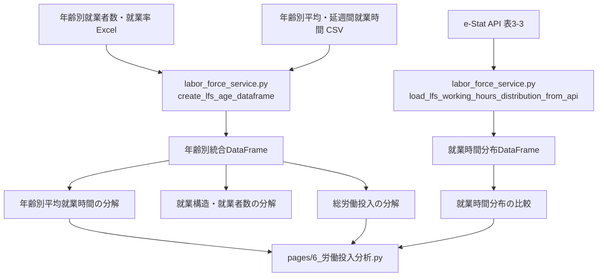
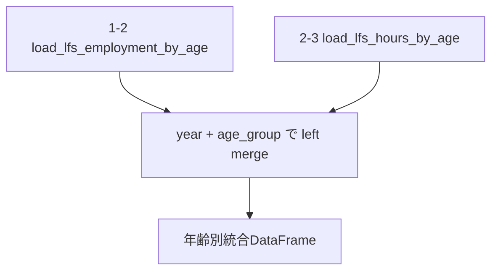
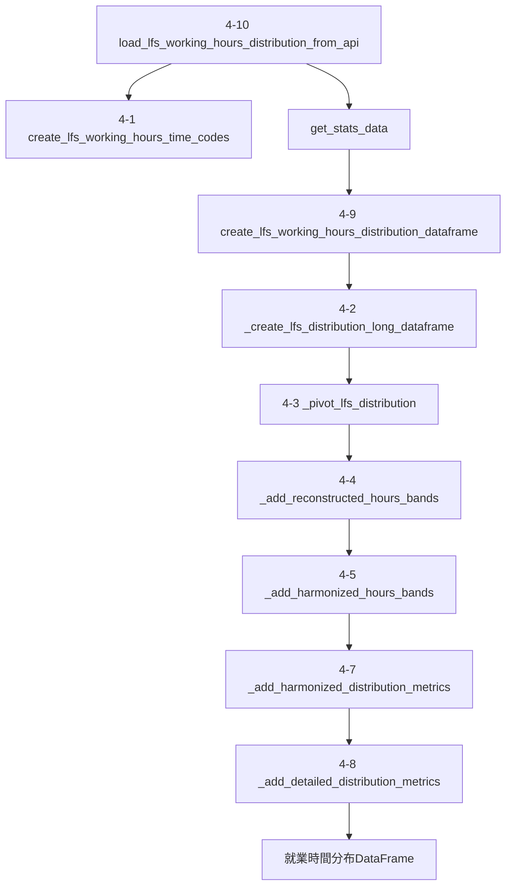
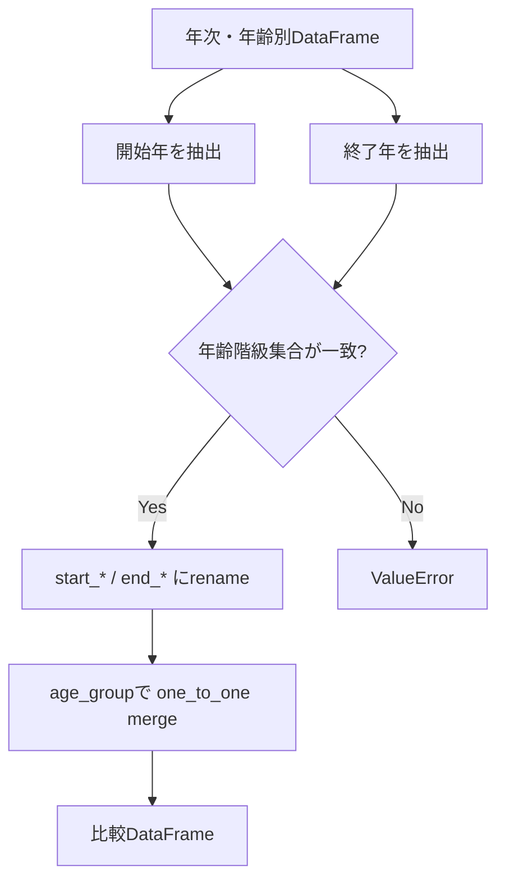
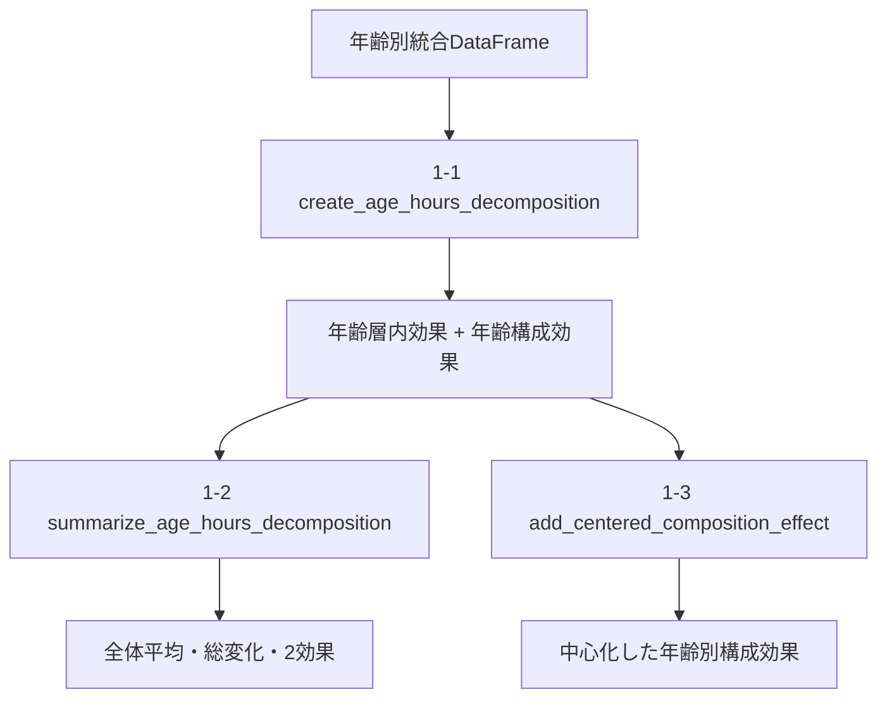
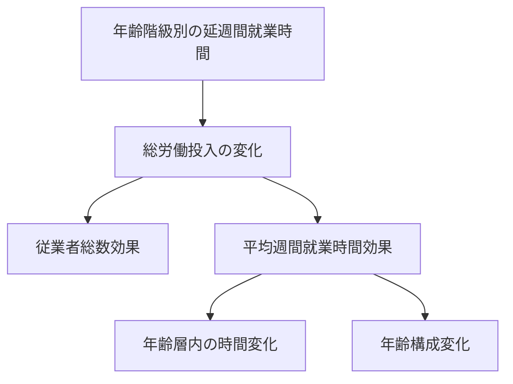
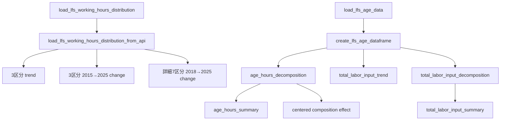
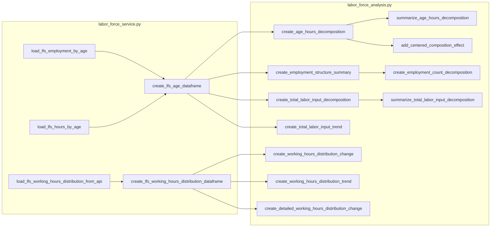

# `labor_force_service.py` / `labor_force_analysis.py` コードフロー

対象:

- `src/real_wage_dashboard/labor_force_service.py`
- `src/real_wage_dashboard/labor_force_analysis.py`
- 主な利用元: `pages/6_労働投入分析.py`

## 1. この2ファイルの役割

労働力調査を使った年齢別・就業時間別の分析は、取得・整形を担当する`labor_force_service.py` と、比較・分解を担当する `labor_force_analysis.py` に分かれています。

`labor_force_service.py` の主な役割は次のとおりです。

1. 年齢別の就業者数・就業率をExcelから読み込む。
2. 年齢別の平均週間就業時間・延週間就業時間をCSVから読み込む。
3. 延週間就業時間 ÷ 平均週間就業時間から `implied_persons_at_work` を作る。
4. `implied_persons_at_work` から年齢別の `worker_share` を作る。
5. 就業構造と就業時間を年・年齢階級で結合する。
6. e-Stat APIから就業時間分布を取得し、3区分・詳細7区分の構成比を作る。

`labor_force_analysis.py` の主な役割は次のとおりです。

1. 平均週間就業時間の変化を、年齢層内効果と年齢構成効果に分解する。
2. 年齢別の就業者数・就業率・就業者構成比の変化を比較する。
3. 就業者数変化を人口要因と就業率要因に分解する。
4. 就業時間3区分・詳細7区分の構成比変化を比較する。
5. 総労働投入の変化を、従業者数・年齢層内時間・年齢構成へ分解する。

現在のStreamlitページで中心的に使われているのは、年齢別平均就業時間、就業時間分布、総労働投入の3系統です。就業者数・就業率の構造分析関数と複数期間要約関数の一部は、現在のページでは直接使用していません。

---

## 2. 全体フロー

2ファイルの関係をまとめると、次の流れです。



重要なのは、`AGE_DF` 内に異なる由来の「人数」指標が存在することです。

- `employed_persons`: 就業者数・就業率Excelから取得した就業者数
- `implied_persons_at_work`: 延週間就業時間 ÷ 平均週間就業時間から逆算した従業者数

`worker_share`、平均週間就業時間の年齢構成分解、総労働投入分解では後者の `implied_persons_at_work` を使います。

---

## 3. `labor_force_service.py` の関数構成

### 3.1 年齢別就業構造

- `_reshape_lfs_employment_by_age`
- `load_lfs_employment_by_age`

`load_lfs_employment_by_age()` がExcelの「総数」シートを読み込み、`_reshape_lfs_employment_by_age()` が年齢階級ごとのlong形式へ変換します。

主な出力列は次の4列です。

| 列 | 内容 |
| --- | --- |
| `year` | 年 |
| `age_group` | 年齢階級 |
| `employed_persons` | 就業者数 |
| `employment_rate` | 就業率 |

対象年齢階級は `EMPLOYMENT_AGE_COLUMNS` で定義された6区分です。

### 3.2 年齢別就業時間

- `_reshape_lfs_hours_by_age`
- `_add_lfs_hours_derived_metrics`
- `load_lfs_hours_by_age`

CSVから次の2指標を取得します。

- `average_weekly_hours`: 平均週間就業時間
- `aggregate_weekly_hours`: 延週間就業時間

その後、次の派生指標を追加します。

```text
implied_persons_at_work
= aggregate_weekly_hours / average_weekly_hours
```

```text
worker_share
= implied_persons_at_work / 同一年の implied_persons_at_work 合計
```

`worker_share` は `employed_persons` の構成比ではありません。就業時間データから逆算した `implied_persons_at_work` の構成比です。

### 3.3 年齢別統合DataFrame

- `create_lfs_age_dataframe`



就業構造データを左側にして、`year` と `age_group` で結合します。結合は `validate="one_to_one"` です。

したがって、就業構造側に存在する年・年齢階級は保持され、対応する就業時間データがない場合は就業時間系の列が欠損になります。

---

## 4. e-Stat就業時間分布のサービスフロー

### 関数の並び

- `create_lfs_working_hours_time_codes`
- `_create_lfs_distribution_long_dataframe`
- `_pivot_lfs_distribution`
- `_add_reconstructed_hours_bands`
- `_add_harmonized_hours_bands`
- `_validate_persons_at_work`
- `_add_harmonized_distribution_metrics`
- `_add_detailed_distribution_metrics`
- `create_lfs_working_hours_distribution_dataframe`
- `load_lfs_working_hours_distribution_from_api`

### API取得から分析用DataFrameまで



`load_lfs_working_hours_distribution_from_api()` は、設定ファイルにある統計表ID・基本フィルタ・年齢コード・就業時間コードを使って e-Stat API を呼び出します。

### 3区分の再構成

長期比較用の3区分は次のとおりです。

| 調和済み区分 | 詳細区分からの再構成 |
| --- | --- |
| `hours_1_34` | 1～14 + 15～29 + 30～34時間 |
| `hours_35_48` | 35～39 + 40～48時間 |
| `hours_49_plus` | 49～59 + 60時間以上 |

`_add_reconstructed_hours_bands()` が詳細区分から再構成値を計算します。

`_add_harmonized_hours_bands()` は、公式の上位区分が存在する場合はその値を優先し、欠損時だけ再構成値で補完します。

したがって、`*_harmonized` が長期比較用の標準列です。

### 3区分の構成比

`_add_harmonized_distribution_metrics()` は、次を計算します。

```text
classified_workers
= hours_1_34_harmonized + hours_35_48_harmonized + hours_49_plus_harmonized
```

```text
unclassified_workers
= persons_at_work - classified_workers
```

```text
coverage = classified_workers / persons_at_work
```

各3区分の構成比も `persons_at_work` を分母に計算します。

`_validate_persons_at_work()` により、値が存在する `persons_at_work` が0以下の場合はエラーになります。

### 詳細7区分

`_add_detailed_distribution_metrics()` は、詳細7区分の合計、カバレッジ、各区分の構成比を作ります。

詳細7区分は次のとおりです。

- 1～14時間
- 15～29時間
- 30～34時間
- 35～39時間
- 40～48時間
- 49～59時間
- 60時間以上

---

## 5. `labor_force_analysis.py` の共通処理

### 共通検証

- `_validate_required_columns`
- `_validate_no_missing`

必要列の存在と、計算対象列の欠損を確認します。

### 開始年・終了年の横持ち比較

- `_create_start_end_comparison`

多くの分析関数が共通利用します。



開始年または終了年のデータがない場合、または両年で年齢階級集合が一致しない場合はエラーになります。

この共通処理を直接利用する主な関数は次のとおりです。

- `create_age_hours_decomposition`
- `create_employment_structure_summary`
- `create_working_hours_distribution_change`
- `create_detailed_working_hours_distribution_change`
- `create_total_labor_input_decomposition`

---

## 6. 年齢別平均就業時間の分解

### 関数

- `create_age_hours_decomposition`
- `summarize_age_hours_decomposition`
- `add_centered_composition_effect`
- `create_age_hours_period_summary`

### 基本フロー



年齢階級 `i` について、平均週間就業時間を `H`、従業者構成比を `S` とすると、対称分解は次の形です。

```text
within_effect_i
= (S0_i + S1_i) / 2 × (H1_i - H0_i)
```

```text
composition_effect_i
= (H0_i + H1_i) / 2 × (S1_i - S0_i)
```

`worker_share` は service 側で `implied_persons_at_work` から作られます。

`summarize_age_hours_decomposition()` は年齢階級別の効果を合計し、次を返します。

- 開始年の全体平均週間就業時間
- 終了年の全体平均週間就業時間
- 全体の変化
- 年齢層内効果
- 年齢構成効果
- 分解誤差

### 中心化した構成効果

`add_centered_composition_effect()` は、年齢階級別の構成効果を全体平均時間との差で表現し直します。

```text
reference_hours = (開始年全体平均 + 終了年全体平均) / 2
```

```text
centered_composition_effect_i
= (年齢階級iの2時点平均時間 - reference_hours) × 構成比変化
```

これにより、「どの年齢層への構成シフトが全体平均時間を押し上げたか・押し下げたか」を読みやすくします。

`create_age_hours_period_summary()` は複数の `(start_year, end_year)` を順番に同じ分解へ通す補助関数です。現在のStreamlitページでは直接使用していません。

---

## 7. 年齢別就業構造と就業者数分解

### 関数

- `create_employment_structure_summary`
- `create_employment_count_decomposition`

### 就業構造比較

`create_employment_structure_summary()` は、開始年と終了年について次を比較します。

- `employed_persons`
- `employment_rate`
- `employed_share`

`employed_share` は、この関数内で `employed_persons` の年合計を分母に計算します。したがって、年齢別平均就業時間分解で使う `worker_share` とは別物です。

出力には次の変化列が追加されます。

- `employed_persons_change`
- `employment_rate_change_pt`
- `employed_share_change_pt`

### 就業者数変化の人口・就業率分解

`create_employment_count_decomposition()` は、就業者数と就業率から人口を逆算します。

```text
population = employed_persons / employment_rate
```

就業率は0より大きく100以下である必要があります。

その上で、就業者数変化を対称分解します。

```text
population_effect
= (開始就業率 + 終了就業率) / 2 × 人口変化
```

```text
employment_rate_effect
= (開始人口 + 終了人口) / 2 × 就業率変化
```

この2関数は現在の `pages/6_労働投入分析.py` では直接使用していません。

---

## 8. 就業時間分布の分析

### 3区分

- `create_working_hours_distribution_change`
- `create_working_hours_distribution_trend`
- `create_working_hours_distribution_period_summary`

`create_working_hours_distribution_change()` は、開始年と終了年について年齢階級別に次を比較します。

- `persons_at_work`
- 調和済み3区分の人数
- 調和済み3区分の構成比
- `unclassified_share`

3区分それぞれについて構成比変化を百分率ポイントで計算し、人数変化も追加します。

`create_working_hours_distribution_trend()` は、指定した年齢階級について3区分の構成比を年次時系列で返します。既定値は `15歳以上` です。

`create_working_hours_distribution_period_summary()` は複数期間について、指定年齢階級の3区分構成比変化だけをまとめます。現在のStreamlitページでは直接使用していません。

### 詳細7区分

- `create_detailed_working_hours_distribution_change`

詳細7区分について、開始年と終了年の構成比変化と人数変化を年齢階級別に計算します。

現在のStreamlitページでは、3区分の主比較を2015→2025年、詳細7区分を2018→2025年で作成しています。

---

## 9. 総労働投入の分解

### 関数

- `create_total_labor_input_decomposition`
- `summarize_total_labor_input_decomposition`
- `create_total_labor_input_period_summary`
- `create_total_labor_input_trend`

### 年齢階級別の分解

`create_total_labor_input_decomposition()` は、年齢階級ごとの延週間就業時間の変化を、従業者数効果と1人当たり時間効果に分解します。

ここで使う従業者数は `implied_persons_at_work` です。

年齢階級 `i` について従業者数を `N`、平均週間就業時間を `H` とすると、

```text
aggregate_weekly_hours = N × H
```

として、次の対称分解を行います。

```text
persons_effect_i
= (H0_i + H1_i) / 2 × (N1_i - N0_i)
```

```text
hours_effect_i
= (N0_i + N1_i) / 2 × (H1_i - H0_i)
```

### 全体への集約

`summarize_total_labor_input_decomposition()` は、年齢階級別結果をさらに全体へ集約します。



最終的に総労働投入の変化を次の3要因へ分けます。

```text
総労働投入変化
= 従業者総数効果
+ 年齢層内の就業時間効果
+ 年齢構成効果
+ 分解誤差
```

返り値には、開始・終了時点の総週間就業時間、総従業者数、平均週間就業時間、各効果、分解誤差が含まれます。

`create_total_labor_input_period_summary()` は複数期間について同じ処理を繰り返す補助関数です。現在のStreamlitページでは直接使用していません。

### 長期時系列

`create_total_labor_input_trend()` は年ごとに、

- `total_weekly_hours`
- `total_persons_at_work`
- `average_weekly_hours`

を集計します。

`average_weekly_hours` は年齢階級別平均の単純平均ではなく、

```text
total_weekly_hours / total_persons_at_work
```

として計算します。

---

## 10. Streamlitページからの利用

主な利用元は `pages/6_労働投入分析.py` です。

### service側

| 関数 | ページでの用途 |
| --- | --- |
| `create_lfs_age_dataframe` | `load_lfs_age_data()` を通じて年齢別就業構造・就業時間を読み込む |
| `load_lfs_working_hours_distribution_from_api` | `load_lfs_working_hours_distribution()` を通じてe-Stat就業時間分布を取得する |

### analysis側

| 関数 | ページでの用途 |
| --- | --- |
| `create_age_hours_decomposition` | 2015→2025年の平均週間就業時間を年齢層内・年齢構成へ分解 |
| `summarize_age_hours_decomposition` | 年齢別分解を全体へ集約 |
| `add_centered_composition_effect` | 年齢階級別の構成効果を中心化して表示用に整える |
| `create_working_hours_distribution_trend` | 15歳以上の3区分構成比の長期推移を作成 |
| `create_working_hours_distribution_change` | 2015→2025年の3区分構成比変化を作成 |
| `create_detailed_working_hours_distribution_change` | 2018→2025年の詳細7区分変化を作成 |
| `create_total_labor_input_trend` | 総労働投入・従業者数・平均時間の長期推移を作成 |
| `create_total_labor_input_decomposition` | 2015→2025年の年齢階級別総労働投入分解を作成 |
| `summarize_total_labor_input_decomposition` | 総労働投入を人数・層内時間・年齢構成の3要因へ集約 |

現在ページから直接使用していない主な公開関数は次のとおりです。

- `create_age_hours_period_summary`
- `create_employment_structure_summary`
- `create_employment_count_decomposition`
- `create_working_hours_distribution_period_summary`
- `create_total_labor_input_period_summary`

---

## 11. Streamlitページまで含めた実行順序

ページ読み込み時の労働力調査関連処理を簡略化すると次の順序です。



`load_lfs_age_data()` と `load_lfs_working_hours_distribution()` は `st.cache_data` の対象です。

---

## 12. データの意味を読むときの注意点

### `employed_persons` と `implied_persons_at_work`

この2列は似ていますが、出所も用途も異なります。

| 列 | 出所 | 主な用途 |
| --- | --- | --- |
| `employed_persons` | 年齢別就業者数・就業率Excel | 就業構造、就業者数の人口・就業率分解 |
| `implied_persons_at_work` | 延週間就業時間 ÷ 平均週間就業時間 | `worker_share`、平均時間の構成分解、総労働投入分解 |

したがって、両者を同じ人数系列として置き換えないことが重要です。

### `worker_share` と `employed_share`

- `worker_share`: `implied_persons_at_work` ベース
- `employed_share`: `employed_persons` ベース

分析目的が異なるため、名前が似ていても相互に代用しません。

### 3区分と詳細7区分

3区分は長期比較を優先した調和済み系列です。公式上位区分を優先し、欠測時だけ詳細区分から再構成します。

詳細7区分はより細かな変化を見るための系列です。3区分と同じ期間が必ずしも利用可能とは限りません。

---

## 13. 関数依存関係の要約



この図では補助的な複数期間要約関数を省略しています。それらは対応する単一期間の分析関数と集約関数をループで呼び出すラッパーです。
